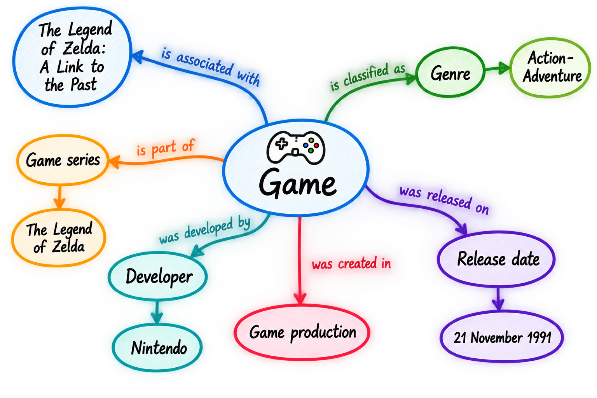
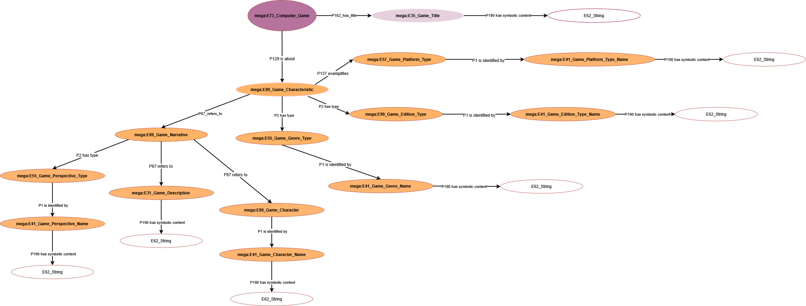
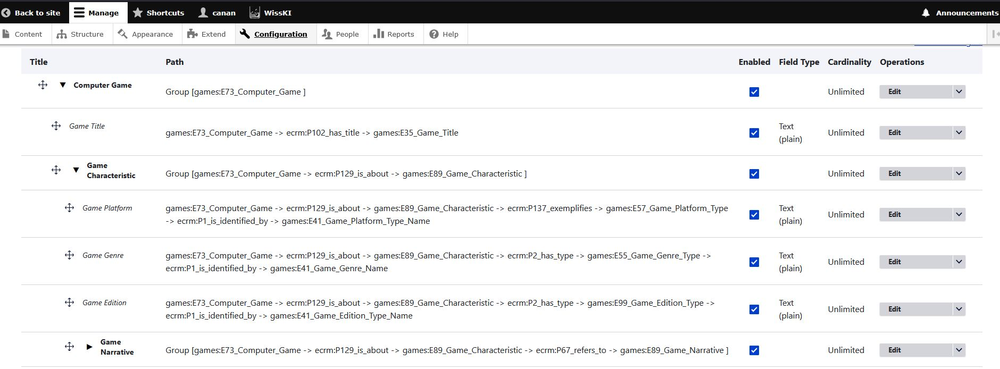

<!--

author: Canan Hastik (0000-0003-1729-4642)

author: Gudrun Schwenk (0009-0002-3156-8339)

email: info@igsd-ev.de

version:  v1.0.0

language: en

icon: https://raw.githubusercontent.com/soda-collections-objects-data-literacy/WissKIBits_How-to-Tutorial/refs/heads/main/assets/SODa-Logo_full.svg

link: https://raw.githubusercontent.com/soda-collections-objects-data-literacy/WissKIBits_How-to-Tutorial/refs/heads/main/soda.css

license: CC BY 4.0 <https://creativecommons.org/licenses/by/4.0/>

comment: This fast-track walkthrough is part of the how-to tutorial “Ontology-Based Modelling of Research Data”. Using a computer game collection as an example, it provides a condensed, exercise-based workflow for experienced users, from conceptual modelling and CIDOC CRM mapping to ontology formalisation and the configuration of semantic paths in WissKI.

title: WissKI Bits Ontology-Based Modelling of Research Data

module: Fast Track – From Collection Object to WissKI Paths

unit: Exercise-Based Walkthrough for Expert Users

description: This SODa WissKI Bits fast track guides experienced users through the practical steps of ontology-based modelling of research data. Using a computer game collection as an example, participants create a conceptual model sketch, map selected concepts to CIDOC CRM, formalise an ontology section in Protégé, prepare a Draw.io diagram, and generate and import semantic paths and path groups in WissKI.

keywords: WissKI, CIDOC CRM, ontology, domain ontology, semantic modelling, research data, research data management, OER

community: Scientific Communication Infrastructure (WissKI) and Collections, Objects, Data Literacy (SODa)

PublicationDate: 2026-10-05

LearningResourceType: How-to-Tutorial

-->

# WissKI Bits: Ontology-Based Modelling of Research Data

**DEVELOPING AND IMPLEMENTING A DATA MODEL USING AN EXAMPLE** 

**Fast Track: From Collection Object to WissKI Paths**

**An Exercise-Based Walkthrough for Expert Users**  

**Audience:** Users familiar with basic semantic modelling, CIDOC CRM, and ontology editors.  

**Goal:** Move from a conceptual sketch through a small OWL ontology section and a Draw.io diagram to imported WissKI paths and path groups.

This fast track contains the practical tasks from Modules 1–3. For explanations, definitions, quizzes, and detailed screenshots, refer to the full tutorial.

**Example:** *The Legend of Zelda: A Link to the Past*  

**Duration:** ~ 90 min.

---

## About This Fast Track

This fast track brings together the **five practical exercises from Modules 1–3** of the WissKI Bits tutorial in one continuous walkthrough. It follows the original sequence and uses the **existing exercise materials**, including the prepared conceptual-model puzzle, the computer games example, Erlangen CRM, the Games ontology, the Draw.io gap diagram, and the gnm-service.

**Example object:** *The Legend of Zelda: A Link to the Past*.

You will begin with a conceptual model sketch, examine selected CIDOC CRM mappings, formalise a small section in Protégé, complete a prepared Draw.io diagram, and convert that diagram into a WissKI Pathbuilder configuration.

**Important:** The activities share a domain and modelling approach, but they do not constitute an automatic file-to-file pipeline. In particular, the Draw.io exercise starts from its **own prepared diagram** rather than an export of the ontology you edit in Protégé.

**Time Plan**

| Activity | Time |
|---|---:|
| Preparation and orientation | 5 min |
| 1. Explore the collection object and create a conceptual sketch | 10 min |
| 2. Map selected concepts to CIDOC CRM | 15 min |
| 3. Formalise a model section in Protégé | 25 min |
| 4. Complete the Draw.io diagram | 15 min |
| 5. Transform and import WissKI paths | 20 min |
| **Total** | **90 min** |

The time plan assumes familiarity with basic semantic modelling and access to a **prepared working environment**. Follow the bounded tasks below; use the linked full units for further explanation or extended exercises.

---

### Before You Start — 5 min

Have the following ready:

- A computer with internet access and [Draw.io / diagrams.net](https://app.diagrams.net/).
- [Protégé Desktop or WebProtégé](https://protege.stanford.edu/), already available and ready to use. For installation help, consult the tutorial's **M2U1A – Setup Protégé** unit.
- Access to a configured WissKI instance with a suitable adapter. The [SODa Semantic Co-Working Space](https://manager.scs.sammlungen.io/de) is an option for the tutorial environment.
- [Erlangen CRM 240307 (OWL)](https://erlangen-crm.org/ontology/ecrm/ecrm_240307.owl), based on CIDOC CRM 7.1.3.
- [CIDOC CRM 7.1.3 documentation and scope notes](https://cidoc-crm.org/html/cidoc_crm_v7.1.3.html).
- [Games domain ontology](http://games.m-e-g-a.org/game_domain.rdf), used in the tutorial's WissKI workflow.

You will use the existing prepared files when prompted below. **Do not start by designing an entirely new ontology or diagram.**

---

## 1. Explore the Collection Object — 10 min

*Based on Module 1, Activation Unit M1U0A: Mindmap of the Application Example from Object Collections.*

**Goal and starting point**

Begin with the collection object *The Legend of Zelda: A Link to the Past*. Ask: **What do you need to know about this object, and how is this knowledge connected?** At this stage, use ordinary domain terminology rather than formal CIDOC CRM classes.

Consider three areas from the original activation exercise:

- **Game title:** How is the game designated?
- **Game characteristics:** Which genre, platform or other classifications matter?
- **Narrative elements:** Which descriptions, perspectives or characters are relevant?

Actors, events, places and times can be considered where they help explain the selected relationships. Distinguish the game as content from a physical game copy if this affects your statements.

---

### Task 1: Complete the Conceptual-Model Puzzle

1. Open [Draw.io](https://app.diagrams.net/) and load the tutorial's prepared [puzzle template (`puzzle.drawio_en.xml`)](https://github.com/soda-collections-objects-data-literacy/WissKIBits_How-to-Tutorial/blob/main/WissKIBits_Modul1/assets/puzzle.drawio_en.xml).
2. Review the **provided** concepts, events and relationships. Arrange and connect the relevant elements to form a meaningful conceptual model sketch of the example object.
3. Read the connections as statements: *Which entity is related to which other entity, and how?* Use meaningful relationship labels.
4. Check whether each statement is supported by the available object information. Mark unresolved or uncertain connections with `?` rather than guessing.
5. Briefly explain one relationship and one uncertainty in your sketch.

**Result:** A conceptual sketch that makes selected domain concepts and relationships visible. **Do not assign CIDOC CRM classes yet.**

**Transition to the Next Exercise**

Your sketch expresses domain knowledge in familiar terms. The next exercise asks whether selected concepts can be represented adequately by **existing CIDOC CRM classes**, and why.

---

## 2. Map Selected Concepts to CIDOC CRM — 15 min

*Based on Module 1, Exercise M1UE: Application Example from Object Collections.*

**Goal**

Use the conceptual sketch as the starting point for **provisional** semantic mappings. A similar-sounding class name is not enough: compare the intended meaning of each concept with the class's **scope note**.

---

### Task 1: Explore and Justify Initial Mappings

1. Select **two concepts or events** from your sketch. Clarify what each means in the collection context.
2. Consult the [CIDOC CRM documentation](https://cidoc-crm.org/html/cidoc_crm_v7.1.3.html) and identify candidate classes. Depending on your chosen concepts, useful starting points may include `E73 Information Object`, `E35 Title`, `E55 Type`, `E21 Person` or `E74 Group`.
3. Read the **scope notes** and compare the candidates with your domain concept. Consider what the class includes or excludes.
4. Record a brief justification and an open question for each mapping.

| Domain concept from your sketch | Candidate CIDOC CRM class | Scope-note-based justification | Open question |
|---|---|---|---|
| Concept 1 | | | |
| Concept 2 | | | |

---

### Task 2: Compare Modelling Decisions

Discuss or reflect briefly: Could the same domain term refer to different things depending on the research question? For example, is a name being used as a title, an identifier, or another kind of appellation? Which additional information would resolve the ambiguity?

**Result:** Two **justified, provisional mappings** and any remaining uncertainty. This is a semantic modelling decision, **not yet an OWL ontology**.

**Transition to the next exercise**

You have explored the difference between a domain concept and a reference-model class. In Protégé, you will now make selected modelling choices explicit as **domain-specific subclasses** of existing CIDOC CRM classes.

---

## 3. Formalise a Small Ontology Section in Protégé — 25 min

*Based on Module 2, Exercise M2UE: Modelling with CIDOC CRM in Protégé.*

**Goal**

Formalise a **limited section** of the computer games domain. Follow the tutorial's lightweight extension strategy: **create subclasses of existing CIDOC CRM classes and reuse existing CIDOC CRM properties; do not define new properties.**

> **Step 1: Load Erlangen CRM**
>
> Open [Erlangen CRM 240307 OWL](https://erlangen-crm.org/ontology/ecrm/ecrm_240307.owl) in Protégé. 
> 
> If you need a reminder of the interface, consult the original [Module 2 exercise](https://github.com/soda-collections-objects-data-literacy/WissKIBits_How-to-Tutorial) and its first-steps video.

> **Step 2: Explore relevant classes**
> 
> Find these classes in the hierarchy:
> 
> - `E41 Appellation`
> - `E35 Title` (a subclass of `E41 Appellation`)
> - `E55 Type`
> - `E73 Information Object`
>
> For each, inspect its place in the hierarchy, annotations and **scope note**. Pay particular attention to the distinction between a general appellation and a title.

> **Step 3: Revisit selected mappings**
>
> Compare the conceptual decisions from Exercise 2 with the formal classes. 
>
> Do not assume that a mapping is correct merely because the names resemble one another.
>
> The original exercise uses examples such as:

| Domain concept | Possible CIDOC CRM class | Question to check |
|---|---|---|
| Game title | `E35 Title` | Which entity is assigned this title? |
| Game genre | `E55 Type` | What exactly is being classified? |
| Game platform type | `E55 Type` | Is this a classification of the game? |

> **Step 4: Create domain-specific subclasses**
> 
> Create the selected example subclasses under the corresponding CIDOC CRM classes:
> 
> - E73 Information Object →  Computer_Game
> - E35 Title → Game_Title
> - E55 Type → Game_Genre_Type, Game_Platform_Type
>
> **Do not create new CIDOC CRM properties.** These rows describe the intended model; inspect the corresponding properties in Protégé and document your choices rather than assuming that the table itself implements the relations.

Use existing CIDOC CRM properties to express intended relationships; the original exercise highlights:

| Source | Existing property | Target | Intended statement |
|---|---|---|---|
| `Computer_Game` | `P102 has title` | `Game_Title` | A computer game has a title. |
| `Computer_Game` | `P2 has type` | `Game_Genre_Type` | A game is assigned to a genre type. |
| `Computer_Game` | `P2 has type` | `Game_Platform_Type` | A game is assigned to a platform type. |

> **Steps 5–6: Review, document and save**
>
> Check that the subclasses are placed under suitable superclasses, that the reused properties express the intended relationships, and that unresolved questions are recorded. Save your work as described in the original exercise if you wish to retain the edited ontology section.
> 
> **Result:** A small formalised and documented ontology section, **not** a complete games ontology.
> 
> **Transition to the next exercise**
> 
> The next exercise uses the **prepared Draw.io gap diagram** from Module 3. It represents selected classes and properties from the same example domain, but it is **not generated automatically from your Protégé file**. You will complete the diagram according to the conventions required by the transformation service.

---

## 4. Complete the Draw.io Diagram — 15 min

*Based on Module 3, Exercise M3UE1: Visualising a Domain Ontology as a Diagram.*

**Goal**

Represent connected semantic paths using selected ontology classes and existing CIDOC CRM properties. Work with the **prepared gap diagram** rather than drawing a new model from scratch.

---

### Task 1: Complete the prepared diagram

1. Download the original [Draw.io XML gap diagram (`Gruppe_B.drawio.xml`)](https://github.com/soda-collections-objects-data-literacy/WissKIBits_How-to-Tutorial/blob/main/WissKIBits_Modul3/assets/Gruppe_B.drawio.xml) and open it in [Draw.io](https://app.diagrams.net/).
2. Identify the missing nodes and edges and replace the temporary `(???)` placeholders.
3. Use the elements specified in the original exercise **where required**, including `P102_has_title`, `P1 is identified by`, `P190 has symbolic content` and `mega:E41_Game_Character_Name`.
4. Connect the classes and properties into **complete semantic paths**. Ensure each property label is attached to its corresponding edge; do not add individual game instances.
5. Inspect the attributes of the central start node and group nodes: `element_id`, `group_name` and `name`. The original exercise gives `Computer_Game` as an example value for these attributes. Check end-node attributes against the **prepared diagram and the original exercise** rather than inventing values.
6. Save or export the completed diagram as **Draw.io XML**.

A path illustrated in the original exercise is:

mega:E73_Computer_Game

  → P102_has_title
  → mega:E35_Game_Title
  → P190 has symbolic content
  → E62_String

**Check before conversion:** No `(???)` placeholders remain; connections are complete; class/property names and required attributes are consistent; the diagram contains **classes and properties**, not individual instances.

**Result:** A completed Draw.io XML diagram ready for the existing gnm-service.

**Transition to the next exercise**

The diagram describes semantic paths visually. The gnm-service converts its XML representation into a **WissKI Pathbuilder XML configuration**, which you will import and inspect in WissKI.

---

## 5. Transform and Import WissKI Paths — 20 min

*Based on Module 3, Exercise M3UE2: Draw.io to WissKI Paths.*

**Goal**

Convert the completed Draw.io diagram into Pathbuilder XML, import the resulting **configuration** into WissKI, and compare the imported paths and path groups with the source diagram.

> Step 1: Transform the Draw.io Diagram
>
> 1. Open the [gnm-service: Draw.io diagrams to WissKI Pathbuilders](https://isl.ics.forth.gr/gnm_services/drawioXMLtoWisskiPathbuilder/).
> 2. Upload the **completed Draw.io XML file** from Exercise 4.
> 3. Start the transformation and inspect the service response.
> 4. Copy or retain the URL of the generated **Pathbuilder XML** file for the WissKI import.
>
> The current service documentation names **Erlangen CRM 240307** and the **Games ontology** as its supported ontology basis. This fast track uses those existing resources and does not require changing the service.

> Step 2: Check the Ontology in WissKI
>
> Log in to your prepared WissKI instance and navigate to **WissKI → Configuration → WissKI Ontology**. Check the configured adapter and the ontology available in the instance. If the required Games ontology is not present, follow the original exercise and the instructions for your instance to load it via the designated adapter:
> 
> [Games domain ontology](http://games.m-e-g-a.org/game_domain.rdf)
> 
> **Important:** Importing Pathbuilder XML does **not** import or define the ontology. The referenced classes and properties must already be available in the ontology used by WissKI.

> Step 3: Create a Pathbuilder and Import the XML
>
> 1. Navigate to **Configuration → Pathbuilders**.
> 2. Select **Add Pathbuilder**, assign a unique name and choose the designated adapter.
> 3. Save and open the new Pathbuilder.
> 4. Find **Pathbuilder Definition Import**, paste the generated XML URL, and start the import.
> 5. Wait for the Pathbuilder structure to appear. **Review the paths before generating bundles or fields.**

> Step 4: Examine the Imported Paths and Path Groups
>
> Find the relationship:
> 
> **Computer_Game → P102 has title → Game_Title**
> 
> 
> Check which path group contains it, identify the property linking the classes, and compare the result with the source diagram. Use the following questions from the original exercise as a quick check:
>
> - Which path group contains this relationship? (Look for **Computer Game**.)
> - Which property connects the source and target classes? (**P102 has title**.)
> - Does the imported path correspond to your source diagram? **Check the actual result**, rather than assuming that the import guarantees correctness.

> Step 5: Verify the Generated Paths
> 
> Compare the imported Pathbuilder configuration with the Draw.io diagram. Check whether the expected path groups exist, the relevant classes and properties are present, and any paths are missing, unexpected or incorrectly grouped. Record anything that may need to be corrected in the diagram or configuration.
> 
> **Result:** A generated, imported and **checked WissKI Pathbuilder configuration**. This is a configuration import, not an ontology import.

---

## Completion Check

- [ ] The prepared conceptual-model puzzle has been completed and uncertain relationships identified.
- [ ] Two provisional CIDOC CRM mappings have been justified using scope notes.
- [ ] A selected ontology section has been formalised in Protégé using domain-specific subclasses and **existing properties**.
- [ ] The provided `Gruppe_B.drawio.xml` gap diagram has been completed and saved as Draw.io XML.
- [ ] The diagram has been converted with the existing gnm-service.
- [ ] The Pathbuilder XML has been imported and the resulting paths and path groups checked in WissKI.

> **Next**
>
> After reviewing the imported Pathbuilder configuration, you can proceed to generating bundles and fields for data entry and display in WissKI, as described in the full tutorial.

---

## Optional Reference: Gnm-service Example Files

The service provides additional examples for checking the transformation format. **They are references, not extra mandatory inputs for this fast track.**

- [Example Draw.io XML input](https://isl.ics.forth.gr/gnm_services/files/examples/diagrams_to_pathbuilders/SODa_ISWC2025.drawio.xml) ([open in diagrams.net](https://app.diagrams.net/#Uhttps%3A%2F%2Fisl.ics.forth.gr%2Fgnm_services%2Ffiles%2Fexamples%2Fdiagrams_to_pathbuilders%2FSODa_ISWC2025.drawio.xml#%7B%22pageId%22%3A%22iUIuGOhsytNMqk53lauw%22%7D); [PNG preview](https://isl.ics.forth.gr/gnm_services/files/examples/diagrams_to_pathbuilders/SODa_ISWC2025.drawio.png)).
- [Optional JSON configuration with default values](https://isl.ics.forth.gr/gnm_services/files/examples/diagrams_to_pathbuilders/config_defaults.json).
- [Example Pathbuilder XML output](https://isl.ics.forth.gr/gnm_services/files/examples/diagrams_to_pathbuilders/DrawioPathBuilderExampleOutput_ISWC2025.xml).

**Scope:** This fast track is a time-bounded selection and connection of the **existing practical exercises**. It does not require developing a new end-to-end model from scratch or extending the gnm-service. For deeper explanations, optional tasks, full screenshots and further reflection, consult the corresponding original units (M1U0A, M1UE, M2UE, M3UE1 and M3UE2).
