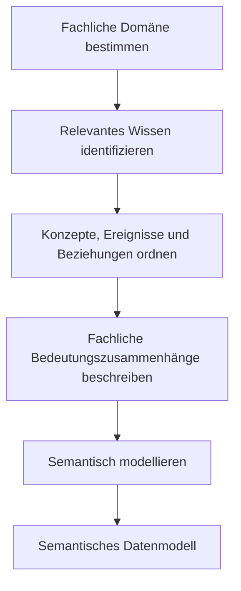

<!--
author: Canan Hastik (0000-0003-1729-4642)

author: Gudrun Schwenk ()

email: c.hastik@igsd-ev.de

email: g.schwenk@igsd-ev.de

version:  v1

language: DE

icon: https://raw.githubusercontent.com/soda-collections-objects-data-literacy/liascript-oers/refs/heads/main/resources/SODa-Logo_full.svg
link: https://raw.githubusercontent.com/soda-collections-objects-data-literacy/SODa_WissKI-ISWC25Bits/refs/heads/main/soda.css

license: CC BY 4.0

comment: Dieser Text erscheint als Info innerhalb der Liascript-Module oben rechts hinter dem (i) und sollte den Inhalt des Moduls kurz beschreiben. Vorschlag: Mirco-Content zum Lernziel "Lernende können FAIR-Prinzipien erläutern". Dieses Modul ist Teil eines Einführungskurses zum Forschungsdatenmanagement, der von “OER.Net UAG FDM-Basiskurs” auf Grundlage der Lernzielmatrix zum FDM entwickelt wurde. Der Basiskurs entwickelt das Konzept der EduBricks weiter und ist als “Arbeitsgruppe 3: Einbettung und Vernetzung des modularen und skalierbaren Konzeptes” zudem Teil der NFDI-Sektion Education and Training.

title: Template für die Erarbeitung eines Micro-Contents anhand eines Lernziels für generischen FDM-Basiskurs

description: Dieses Template wurde als Vorlage für die Entwicklung von Microlearning-Content zum Themenbereich Forschungsdatenmanagement (FDM) in Orientierung an Lernzielen der [Lernzielmatrix zum Forschungsdatenmanagement (FDM)](https://zenodo.org/records/15025246) entwickelt.

keywords: FDM, Forschungsdatenmanagement, Forschungsdaten, Lernziel, Micro-Content

community: Wissenschaftliche Kommunikationsinfrastruktur (WissKI) und Sammlungen, Objekte, Datenkompetenzen (SODa)

PublicationDate: noch unveröffentlicht

LearningResourceType: SODa How-to-Tutorial

-->

# WissKI Bits: Ontologiegestützte Modellierung von Forschungsdaten

**DATENMODELL ENTWICKELN UND IMPLEMENTIEREN AM BEISPIEL** 

Modul 1: **Von der Sammlung über Modellierentscheidungen zum Diagramm – verstehen und erklären**

Einheit 1: **Grundbegriffe konzeptueller Wissensmodellierung**  

**Dauer:** ca. XX Min.

**Lernziele:**

Teilnehmende können...

- Begriff Attribut benennen. (LZ-ID SODa\_xy\_xyz\_xyza) ??? löschen oder  verschieben in E0
- Begriff semantische Modellierung benennen. (LZ-ID SODa\_03\_007\_0825) ??? löschen oder  verschieben in E0
- Begriff semantisches Datenmodell benennen (LZ-ID SODa\_xy\_xyz\_xyza) ??? löschen oder verschieben in E0
- Begriff konzeptuelle Wissensmodellierung benennen.
- Begriff konzeptuelle Wissensmodellierung erläutern.
- Begriff Domäne benennen. (LZ-ID SODa\_03\_007\_0824)
- Begriff Konzept benennen. (LZ-ID SODa\_03\_007\_0821)
- Begriff Ereignis benennen. (LZ-ID SODa\_03\_007\_0822)
- Begriff Beziehung benennen. (LZ-ID SODa\_03\_007\_0823)
  
---

## Grundlagen der konzeptuellen Wissensmodellierung

In den Geistes- und Kulturwissenschaften, in GLAM-Institutionen und in Forschungssammlungen wird mit komplexen Objekt- und Kontextdaten gearbeitet. Diese Daten tragen historische, kulturelle und soziale Bedeutungen, etwa Informationen zu Provenienz, beteiligten Personen, Ereignissen, Beziehungen oder unterschiedlichen Interpretationen.

Tabellen können Daten zwar erfassen und einzelne Eigenschaften beziehungsweise Merkmale – sogenannte Attribute – von Datenobjekten darstellen (Fischer2010encyclopcompscience, S. 77). 

Der fachliche Bedeutungszusammenhang, in dem diese Datenobjekte stehen, bleibt dabei jedoch häufig implizit. Dazu gehören insbesondere die zugrunde liegenden Konzepte, ihre Beziehungen und ihre historischen oder kulturellen Kontexte.

Damit Forschungsdaten langfristig inhaltlich interpretierbar und nachnutzbar bleiben, muss deshalb auch ihre Bedeutung erfasst und formal beschrieben werden (Fichtner2025paths, S. 58). Dazu wird modelliert, wie Daten innerhalb eines bestimmten Wissensbereichs verstanden, interpretiert und miteinander in Beziehung gesetzt werden (Schwenk2025sodaforumconservation, S. 21).

ODER ALS LISTE:

- Forschungs- und Sammlungsdaten enthalten komplexe Objekt- und Kontextinformationen.
- Sie tragen historische, kulturelle und soziale Bedeutungen, zum Beispiel: Provenienz, beteiligte Personen und Institutionen, Ereignisse und Beziehungen, unterschiedliche Interpretationen.
- Tabellen bilden vor allem Eigenschaften beziehungsweise **Attribute** von Datenobjekten ab (Fischer2010encyclopcompscience, S. 77).
- Fachliche Bedeutungszusammenhänge bleiben dabei häufig implizit.
- Für die langfristige Interpretation und Nachnutzung muss daher auch die Bedeutung der Daten formal beschrieben werden (Fichtner2025paths, S. 58).
- Modelliert wird, wie Daten in einer Domäne verstanden, interpretiert und miteinander in Beziehung gesetzt werden (Schwenk2025sodaforumconservation, S. 21). --> kürze den Key doch auf (Schwenk2025forum) 

---

## Begriffsdefinitionen der konzeptuellen Wissensmodellierung

Vorschlag neu:

Bei der **konzeptuellen Wissensmodellierung** wird herausgearbeitet, welches Wissen innerhalb einer Domäne relevant ist und wie dieses Wissen konzeptuell geordnet werden kann.

Eine **Domäne** ist der fachlich abgegrenzte Wissens- und Anwendungsbereich, für den Wissen beschrieben und modelliert wird. In der semantischen Datenmodellierung umfasst eine Domäne die fachlich relevanten Konzepte, Ereignisse und Beziehungen, beispielsweise den Bereich einer Forschungs- oder Objektsammlung.

Zentrale Elemente der konzeptuellen Wissensmodellierung sind **Konzepte, Ereignisse und Beziehungen**:

- **Konzepte** sind abstrakte Vorstellungen oder Begriffe, mit denen relevante Gegenstände und Sachverhalte einer Domäne geordnet werden. Beispiele sind Objekt, Person, Ort oder Institution.
- **Ereignisse** beschreiben zeitlich und räumlich einordenbare Geschehnisse oder Prozesse, an denen Objekte, Personen oder andere Konzepte beteiligt sein können. Beispiele sind Herstellung, Erwerb, Fund, Restaurierung, Ausstellung oder Nutzung eines Objekts.
- **Beziehungen** beschreiben bedeutungstragende Verknüpfungen zwischen Konzepten oder zwischen Konzepten und Ereignissen. Beispiele sind „Person nahm an Herstellung teil“, „Herstellung fand an Ort statt“ oder „Objekt wurde durch Herstellung erzeugt“.

Die Identifikation und Strukturierung dieser Elemente bildet die Grundlage der **semantischen Modellierung**.

**Semantische Modellierung** bezeichnet den konzeptuellen Prozess, die Begriffe, Konzepte und Beziehungen eines Wissensbereichs zu identifizieren, zu strukturieren und zu formalisieren (Schwenk2025sodaforumconservation, S. xy). Dieser Prozess verbindet fachwissenschaftliches Wissen mit Modellierungskompetenz (Fichtner2025paths, S. 86).

Das Ergebnis dieses Prozesses ist ein **semantisches Datenmodell**. Es bildet nicht die einzelnen konkreten Forschungsdaten ab, sondern beschreibt als konzeptueller und formaler Rahmen, wie Daten einer Domäne verstanden, interpretiert und miteinander in Beziehung gesetzt werden.

> **Merksatz:** Die konzeptuelle Wissensmodellierung klärt, welches Wissen relevant ist und wie es geordnet wird. Die semantische Modellierung formalisiert diese fachliche Ordnung. Das semantische Datenmodell ist das Ergebnis dieses Prozesses.

alt:

Bei der **Konzeptuellen Wissensmodellierung** wird herausgearbeitet welches Wissen innerhalb einer Domäne relevant ist und wie es konzeptuell geordnet werden kann.

Eine **Domäne** bezeichnet einen Wertebereich (Fischer2010encyclopcompscience, S. 257) für den Wissen beschrieben und modelliert wird. In der **semantischen Datenmodellierung** versteht man unter Domäne den fachlichen Wissens- und Anwendungsbereich, dessen Konzepte, Ereignisse und Beziehungen erfasst und formal repräsentiert werden. (Quelle?)

Zentralen Elemente der konzeptuellen Wissensmodellierung sind **Konzept, Ereignis und Beziehung**.

- **Konzepte** sind abstrakte Begriffe, die die zentrale Bausteine einer Domäne bezeichnen. Beispiele sind Objekte, Personen, Orte, Institutionen.
- **Ereignisse** sind eine strukturierte Sammlung von Abläufen, Hergängen und Prozessen die kontextbezogene informationen über Konzepte bereitstellen. Beispiele sind Herstellung, Erwerb, Fund, Restaurierung, Ausstellung oder Nutzung eines Objektes.
- **Beziehungen** beschreiben die semantische Verknüpfung zwischen Konzepten oder zwischen Konzepten und Ereignissen. Beispiele sind Objekt "wurde hergestellt von" Person und Objekt "wurde hergestellt" bei Herstellung.

Die Identifikation und Strukturierung dieser Elemente bildet die Grundlage der **semantischen Modellierung**. 

Erst wenn die relevanten Konzepte, Ereignisse, Beziehungen einer Domäne verstanden und strukturiert sind, können sie in einem semantischen Datenmodell dargestellt werden. 

ALTEnde

> **Abbildung:** Die Grafik veranschaulicht den Weg von der Bestimmung einer fachlichen Domäne über die konzeptuelle Ordnung des relevanten Wissens bis zum semantischen Datenmodell.

---

## Übung: Wissen einer Sammlung konzeptuell ordnen

**Arbeitsform:** Einzel- oder Kleingruppenarbeit  
**Material:** Board, Moderationskarten oder Papier  
**Zeit:** 10 Min.

### Aufgabe

Denkt an ein typisches Objekt aus eurer Sammlung oder Forschung.

**1. Relevante Informationen auswählen:** Überlegt, welche Informationen über das Objekt interessant bzw. relevant sein können. Wählt daraus ein oder zwei beispielhafte Informationen aus und formuliert dazu zwei kurze Aussagen.

**2. Konzepte und Ereignis identifizieren:** Untersucht anschließend eure Aussagen:

- Welche **zwei Konzepte** sind im Kontext des Objekts relevant und lassen sich sinnvoll miteinander verknüpfen?

- Welches **Ereignis** steht in einem sinnvollen Zusammenhang mit einem dieser Konzepte?

> **Note**
> 1. **Konzepte:** Welche zentralen Bausteine lassen sich identifizieren?
> 2. **Ereignisse:** Welche Geschehnisse oder Prozesse lassen sich identifizieren?
> 3. **Beziehungen:** Wie sind die Konzepte und Konzepte oder Konzepte und Ereignisse miteinander verbunden?

Ordnet die gefundenen Elemente auf dem [Board](https://miro.com/app/board/uXjVGKauOtE=/) oder auf Papier den drei Kategorien zu.

**3. Semantische Zusammenhänge formulieren:** Stellt die semantischen Zusammenhänge in folgeder Form dar:

- **Konzept --> Beziehung --> Konzept**

- **Konzept --> Beziehung --> Ereignis**

**Hinweis:**

**1. Relevante Informationen auswählen:** Überlegt, welche Informationen über das Objekt interessant bzw. relevant sein können:

> z. B. das Objekt ist ein Spiel, Titel des Spiels, Entwickler des Spiels, Entwicklungszeit des Spiels, Veröffentlichungsort des Spiels, Veröffentlichungszeitpunkt des Spiels uvm.

Wählt daraus ein oder zwei beispielhafte Informationen aus und formuliert dazu zwei kurze Aussagen:

> Das Spiel „The Legend of Zelda: A Link to the Past“ wurde von Nintendo entwickelt und 1991 in Japan veröffentlicht.

**2. Konzepte und Ereignis identifizieren:** Untersucht anschließend eure Aussagen:

1. **Konzepte:** Welche zentralen Bausteine lassen sich identifizieren?
2. **Ereignisse:** Welche Geschehnisse oder Prozesse lassen sich identifizieren?
3. **Beziehungen:** Wie sind die Konzepte und Konzepte oder Konzepte und Ereignisse miteinander verbunden?

Ordnet die gefundenen Elemente auf dem [Board](https://miro.com/app/board/uXjVGKauOtE=/) oder auf Papier den drei Kategorien zu.

---

| Konzept | Konzept | Beziehung |
|---|---|---|
| Spiel | Titel | Das Spiel hat den Titel "The Legend of Zelda..." |

---

| Konzept | Ereignis | Beziehungen |
|---|---|---|
| Spiel | Entwicklung | Spiel wurde durch Entwicklung geschaffen |
| Nintendo | Veröffentlichung | Nintendo war an Entwicklung beteiligt |
| Japan | Veröffentlichung | Veröffentlichung fand in Japan statt |
| 1991 | Veröffentlichung  | Veröffentlichung fand 1991 statt |

### Leitfragen

Prüft eure Auswahl:

- Welche Information ist für das Verständnis des Objekts unverzichtbar?
- Welche Information beschreibt nur ein Merkmal des Objekts?
- Welche Information stellt das Objekt in einen größeren Zusammenhang?
- Lassen sich beteiligte Personen, Orte und Zeiten erkennen?
- Bleiben wichtige Zusammenhänge noch unausgesprochen?

---

## Ergebnis

Am Ende liegt eine erste fachliche Ordnung eines Wissensbereichs vor:

- relevante Konzepte wurden benannt,
- Ereignisse wurden identifiziert,
- Beziehungen wurden als Aussagen formuliert.

Musterbeispiel als Grafik (todo canan)
  
---

## Zusammenfassung

(überarbeiten) 

Anforderungen aus der Sammlungspraxis bilden die Grundlage, um in diesem Modul 1 zentrale Konzepte, Ereignisse und Beziehungen zu identifizieren und daraus ein konsistentes, nachvollziehbares Domänenmodell und -diagramm zu entwickeln. 

Damit können Forschungsfragen an Sammlungen gestellt werden, wie...

- „… der Herstellungs-/Entstehungskontext klar ist.“
- „… Akteur:innen und Rollen unterscheidbar sind.“
- „… Provenienzereignisse nachvollziehbar sind.“
- „… Ort und Zeit belastbar sind.“
- „… Unsicherheiten (Hypothesen) abbildbar sind.“
- „… eine eindeutige Identifizierung durch z. B. Signatur-/Inventarnummer möglich ist.“

---

## Ausblick

... kurz: wie setzen wir das mit Ontologien nun um?... was haben Ontologien damit zu tun...

---

## Bibliographie

[Fichtner2025paths] Fichtner, M. (2025). Grundlagen der Erzeugung und Verwaltung von Ontologiepfaden und ihre Anwendung (Doctoral thesis, Friedrich-Alexander-Universität Erlangen-Nürnberg, Technische Fakultät). https://doi.org/10.25593/open-fau-2143

[Fischer2010encyclopcompscience] Fischer, P. & Hofer, P. (2010). Lexikon der Informatik. https://doi.org/10.1007/978-3-642-15126-2

[Rehbein2017ontologies] Rehbein, M. (2017). Ontologien. In: F. Jannidis, H. Kohle, & M. Rehbein (Hrsg.), *Digital Humanities* (S. 162-176). J.B. Metzler, Stuttgart. https://doi.org/10.1007/978-3-476-05446-3_11

[Schwenk2025sodaforumconservation] Schwenk , G. A. & Fischer, K. (2025), SODa Forum: Konservierungs- und Restaurierungsdokumentation gemeinsam weiterdenken - Ontologieentwicklung im Dialog. Zenodo. https://doi.org/10.5281/zenodo.15481743

