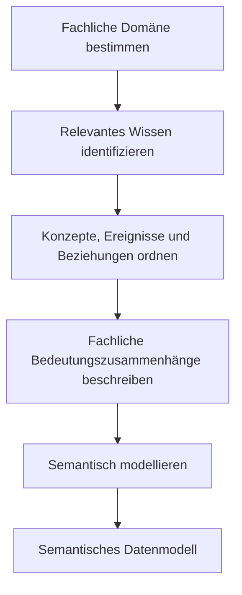
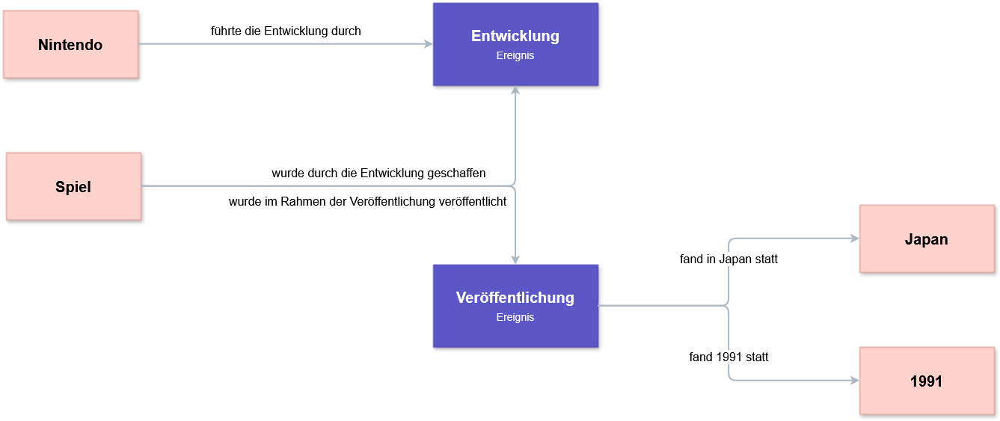

<!--
author: Canan Hastik (0000-0003-1729-4642)

author: Gudrun Schwenk ()

email: c.hastik@igsd-ev.de

email: g.schwenk@igsd-ev.de

version:  v1

language: DE

icon: https://raw.githubusercontent.com/soda-collections-objects-data-literacy/liascript-oers/refs/heads/main/resources/SODa-Logo_full.svg
link: https://raw.githubusercontent.com/soda-collections-objects-data-literacy/SODa_WissKI-ISWC25Bits/refs/heads/main/soda.css

license: CC BY 4.0

comment: Dieser Text erscheint als Info innerhalb der Liascript-Module oben rechts hinter dem (i) und sollte den Inhalt des Moduls kurz beschreiben. Vorschlag: Mirco-Content zum Lernziel "Lernende können FAIR-Prinzipien erläutern". Dieses Modul ist Teil eines Einführungskurses zum Forschungsdatenmanagement, der von “OER.Net UAG FDM-Basiskurs” auf Grundlage der Lernzielmatrix zum FDM entwickelt wurde. Der Basiskurs entwickelt das Konzept der EduBricks weiter und ist als “Arbeitsgruppe 3: Einbettung und Vernetzung des modularen und skalierbaren Konzeptes” zudem Teil der NFDI-Sektion Education and Training.

title: Template für die Erarbeitung eines Micro-Contents anhand eines Lernziels für generischen FDM-Basiskurs

description: Dieses Template wurde als Vorlage für die Entwicklung von Microlearning-Content zum Themenbereich Forschungsdatenmanagement (FDM) in Orientierung an Lernzielen der [Lernzielmatrix zum Forschungsdatenmanagement (FDM)](https://zenodo.org/records/15025246) entwickelt.

keywords: FDM, Forschungsdatenmanagement, Forschungsdaten, Lernziel, Micro-Content

community: Wissenschaftliche Kommunikationsinfrastruktur (WissKI) und Sammlungen, Objekte, Datenkompetenzen (SODa)

PublicationDate: noch unveröffentlicht

LearningResourceType: SODa How-to-Tutorial

-->

# WissKI Bits: Ontologiegestützte Modellierung von Forschungsdaten

**DATENMODELL ENTWICKELN UND IMPLEMENTIEREN AM BEISPIEL** 

Modul 1: **Von der Sammlung über Modellierentscheidungen zum Diagramm – verstehen und erklären**

Einheit 1: **Grundbegriffe konzeptueller Wissensmodellierung**  

**Dauer:** ca. XX Min.

**Lernziele:**

Teilnehmende können...

- Begriff konzeptuelle Wissensmodellierung benennen. (LZ-ID SODa\_03\_007\_0847)
- Begriff konzeptuelle Wissensmodellierung erläutern. (LZ-ID SODa\_03\_007\_0848)
- Begriff Domäne benennen. (LZ-ID SODa\_03\_007\_0824)
- Begriff Konzept benennen. (LZ-ID SODa\_03\_007\_0821)
- Begriff Ereignis benennen. (LZ-ID SODa\_03\_007\_0822)
- Begriff Beziehung benennen. (LZ-ID SODa\_03\_007\_0823)
- Begriff semantische Modellierung benennen. (LZ-ID SODa\_03\_007\_0825)
- Begriff semantische Modellierung erläutern. (LZ-ID SODa\_03\_007\_0844)
- Begriff semantisches Datenmodell benennen. (LZ-ID SODa\_03\_007\_0845)
- Begriff semantisches Datenmodell erläutern. (LZ-ID SODa\_03\_007\_0846)
  
---

## Begriffsdefinitionen der konzeptuellen Wissensmodellierung

Bei der **konzeptuellen Wissensmodellierung** wird herausgearbeitet, welches Wissen innerhalb einer Domäne relevant ist und wie dieses Wissen konzeptuell geordnet werden kann.

Eine **Domäne** ist der fachlich abgegrenzte Werte-, Wissens- und Anwendungsbereich (Fischer2010encyclop, S. 257), für den Wissen beschrieben und modelliert wird. In der semantischen Modellierung umfasst eine Domäne die fachlich relevanten Konzepte, Ereignisse und Beziehungen, beispielsweise den Bereich einer Forschungs- oder Objektsammlung. (Quelle - todo Gudrun)

Zentrale Elemente der konzeptuellen Wissensmodellierung sind **Konzepte, Ereignisse und Beziehungen**:

- **Konzepte** sind abstrakte Vorstellungen oder Begriffe, mit denen relevante Gegenstände und Sachverhalte einer Domäne bezeichnet werden. Beispiele sind Objekt, Person, Ort oder Institution.
- **Ereignisse** beschreiben zeitlich und räumlich einordbare Geschehnisse oder Prozesse, an denen Objekte, Personen oder andere Konzepte beteiligt sein können. Beispiele sind Herstellung, Erwerb, Fund, Restaurierung, Ausstellung oder Nutzung eines Objekts.
- **Beziehungen** beschreiben bedeutungstragende Verknüpfungen zwischen Konzepten oder zwischen Konzepten und Ereignissen. Beispiele sind „Person nahm an Herstellung teil“, „Herstellung fand an Ort statt“ oder „Objekt wurde durch Herstellung erzeugt“.

Die Identifikation und Strukturierung dieser Elemente bildet die Grundlage der **semantischen Modellierung**.

**Semantische Modellierung** bezeichnet den konzeptuellen Prozess (engl. *conceptualization*), die Begriffe, Konzepte und Beziehungen eines Wissensbereichs zu identifizieren und zu strukturieren und als Ontologie formalisiert darzustellen. (Rehbein2017ontology, S. 164, Schwenk2025sodaforumconservation, S. 23) Dieser Prozess verbindet fachwissenschaftliches Wissen mit Modellierungskompetenz (Fichtner2025paths, S. 86).

Das Ergebnis dieses Prozesses ist ein **semantisches Datenmodell**. Es bildet nicht die einzelnen konkreten Forschungsdaten ab, sondern beschreibt als konzeptueller und formaler Rahmen, wie Daten einer Domäne verstanden, interpretiert und miteinander in Beziehung gesetzt werden. (Quelle - todo Gudrun)

> **Merksatz:** Die konzeptuelle Wissensmodellierung klärt, welches Wissen relevant ist und wie es geordnet wird. Die semantische Modellierung formalisiert diese fachliche Ordnung. Das semantische Datenmodell ist das Ergebnis dieses Prozesses.

> **Abbildung:** Die Grafik veranschaulicht den Weg von der Bestimmung einer fachlichen Domäne über die konzeptuelle Ordnung des relevanten Wissens bis zum semantischen Datenmodell.

---

## Übung: Wissen einer Sammlung konzeptuell ordnen

**Arbeitsform:** Einzel- oder Kleingruppenarbeit  
**Material:** Board, Moderationskarten oder Papier  
**Zeit:** 10 Min.

### Aufgabe

Denkt an ein typisches Objekt aus eurer Sammlung oder Forschung.

**1. Relevante Informationen auswählen:** 

- Überlegt, welche Informationen über das Objekt interessant bzw. relevant sein können.

- Wählt daraus ein oder zwei beispielhafte Informationen aus und formuliert dazu zwei kurze Aussagen.

- Untersucht anschließend eure Aussagen.

> **Prüft eure Auswahl:**
> - Welche Information ist für das Verständnis des Objekts unverzichtbar?
> - Welche Information beschreibt nur ein Merkmal des Objekts?
> - Welche Information stellt das Objekt in einen größeren Zusammenhang?
> - Lassen sich beteiligte Personen, Orte und Zeiten erkennen?
> - Bleiben wichtige Zusammenhänge noch unausgesprochen?

**2. Konzepte und Ereignis identifizieren:**

- Ordnet die gefundenen Informationen auf dem [Board](https://miro.com/app/board/uXjVGKauOtE=/) oder auf Papier den folgenden drei Kategorien zu.

- Welche **zwei Konzepte** sind im Kontext des Objekts relevant und lassen sich sinnvoll miteinander verknüpfen?

- Welches **Ereignis** steht in einem sinnvollen Zusammenhang mit einem dieser Konzepte?

- In welchen semantischen Zusammenhängen (**Beziehungen**) stehen die Konzepte und Ereignisse?

> **Erinnerungshilfe**
> 1. **Konzepte:** Welche zentralen Bausteine lassen sich identifizieren?
> 2. **Ereignisse:** Welche Geschehnisse oder Prozesse lassen sich identifizieren?
> 3. **Beziehungen:** Wie sind die Konzepte und Konzepte oder Konzepte und Ereignisse miteinander verbunden?

**3. Beziehungen formulieren:** 

- Stellt die semantischen Zusammenhänge in tabellarischer Form dar.

| Konzept | Konzept | Beziehung |
|---|---|---|
| Konzept 1  | Konzept 2  | Konzept 1 hat spezifische Beziehung zu Konzept 2 |

| Konzept | Ereignis| Beziehung |
|---|---|---|
| Konzept 1  | Ereignis 1 | Konzept 1 hat spezifische Beziehung zu Ereignis 1 |

---

**Hinweis:**

**1. Relevante Informationen auswählen:** Überlegt, welche Informationen über das Objekt interessant bzw. relevant sein können:

> z. B. das Objekt ist ein Spiel, Titel des Spiels, Entwickler des Spiels, Entwicklungszeit des Spiels, Veröffentlichungsort des Spiels, Veröffentlichungszeitpunkt des Spiels uvm.

Wählt daraus ein oder zwei beispielhafte Informationen aus und formuliert dazu zwei kurze Aussagen:

> Das Spiel „The Legend of Zelda: A Link to the Past“ wurde von Nintendo entwickelt und 1991 in Japan veröffentlicht.

**2. Konzepte und Ereignis identifizieren:** Untersucht anschließend eure Aussagen:

- Welche **zwei Konzepte** sind im Kontext des Objekts relevant und lassen sich sinnvoll miteinander verknüpfen?

> Spiel, Titel

- Welches **Ereignis** steht in einem sinnvollen Zusammenhang mit einem dieser Konzepte?

> Veröffentlichung

**3. Beziehungen identifizieren:**

| Konzept | Konzept | Beziehung |
|---|---|---|
| Spiel | Titel | Das Spiel hat den Titel "The Legend of Zelda..." |

| Konzept | Ereignis | Beziehungen |
|---|---|---|
| Spiel | Entwicklung | Spiel wurde durch Entwicklung geschaffen |
| Nintendo | Veröffentlichung | Nintendo war an Entwicklung beteiligt |
| Japan | Veröffentlichung | Veröffentlichung fand in Japan statt |
| 1991 | Veröffentlichung  | Veröffentlichung fand 1991 statt |

---

## Ergebnis

Am Ende liegt eine erste konzeptuelle Ordnung eines Wissensbereichs, einer Domäne, vor:

- relevante Konzepte wurden benannt,
- Ereignisse wurden identifiziert,
- Beziehungen wurden als Aussagen formuliert.

### Musterbeispiel in Tabellenform

| Konzept  | Ereignis         | Beziehung                                                      |
| -------- | ---------------- | -------------------------------------------------------------- |
| Spiel    | Entwicklung      | Das Spiel wurde durch die Entwicklung geschaffen.              |
| Nintendo | Entwicklung      | Nintendo führte die Entwicklung durch.                         |
| Spiel    | Veröffentlichung | Das Spiel wurde im Rahmen der Veröffentlichung veröffentlicht. |
| Japan    | Veröffentlichung | Die Veröffentlichung fand in Japan statt.                      |
| 1991     | Veröffentlichung | Die Veröffentlichung fand 1991 statt.                          |

### Musterbeispiel als Grafik

> **Abbildung:** Die Grafik veranschaulicht ....

---

## Zusammenfassung

Die konzeptuelle Wissensmodellierung strukturiert das relevante Fachwissen einer Domäne anhand von Konzepten, Ereignissen und Beziehungen. 

Anforderungen aus der Sammlungspraxis bilden die Grundlage, um in diesem Modul 1 zentrale Konzepte, Ereignisse und Beziehungen zu identifizieren und daraus ein konsistentes, nachvollziehbares Domänenmodell und -diagramm zu entwickeln. 

Damit können Forschungsfragen an Sammlungen gestellt und beantwortet werden, wie:

- **Herstellung & Entstehung:** In welchem konkreten Kontext und durch welche Prozesse entstand das Objekt?
- **Akteur:innen & Rollen:** Welche Personen waren beteiligt und welche spezifischen Rollen nehmen sie ein?
- **Provenienz:** Über welche Stationen und Ereinisse gelangte das Objekt in die Sammlung?
- **Ort & Zeit:** Wie verlässlich lassen sich die geografischen und zeitlichen Angaben der Objekthistorie belegen?
- **Unsicherheiten:** Wie lassen sich widersprüchliche Hypothesen oder vage Zuschreibunen im Datenmodell abbilden?
- **Identifikation:** Wie lässt sich das Objekt über eindeutige Merkmale wie Inventarnummern exakt identifizieren und referenzieren?

---

## Ausblick

Durch die konzeptuelle Wissensmodellierung haben wir in einem ersten Schritt herausgearbeitet, welches Wissen innerhalb einer Domäne relevant ist und wie dieses strukturell geordnet werden kann. Um diese gedankliche oder konzeptuelle Ordnung nun in einem formalen, maschinenlesbaren System darzustellen, werden Ontologien herangezogen. In Einheit 2 werden die allgemeinen Grundlagen von Ontologien vorgestellt.

---

## Bibliografie

[Fichtner2025paths] Fichtner, M. (2025). Grundlagen der Erzeugung und Verwaltung von Ontologiepfaden und ihre Anwendung (Doctoral thesis, Friedrich-Alexander-Universität Erlangen-Nürnberg, Technische Fakultät). https://doi.org/10.25593/open-fau-2143

[Fischer2010encyclop] Fischer, P. & Hofer, P. (2010). Lexikon der Informatik. https://doi.org/10.1007/978-3-642-15126-2

[Rehbein2017ontology] Rehbein, M. (2017). Ontologien. In: F. Jannidis, H. Kohle, & M. Rehbein (Hrsg.), Digital Humanities (S. 162-176). J.B. Metzler, Stuttgart. https://doi.org/10.1007/978-3-476-05446-3_11

[Schwenk2025sodaforumconservation] Schwenk , G. A. & Fischer, K. (2025), SODa Forum: Konservierungs- und Restaurierungsdokumentation gemeinsam weiterdenken - Ontologieentwicklung im Dialog. Zenodo. https://doi.org/10.5281/zenodo.15481743

