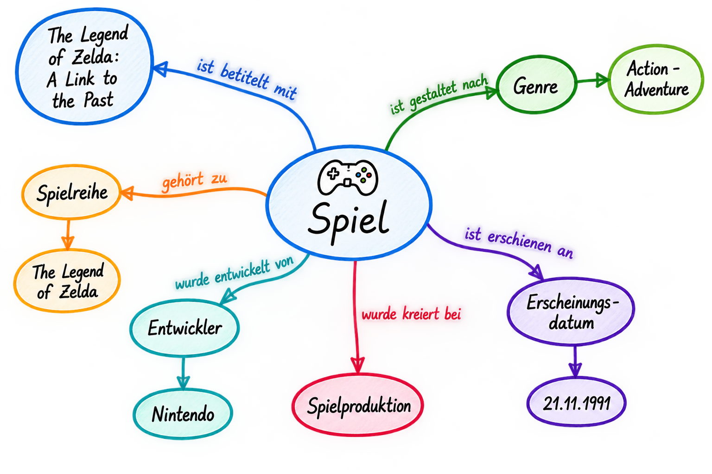

<!--

author: Canan Hastik (0000-0003-1729-4642)

author: Gudrun Schwenk (0009-0002-3156-8339)

email: info@igsd-ev.de

version:  v1.0.0

language: en

icon: https://raw.githubusercontent.com/soda-collections-objects-data-literacy/WissKIBits_How-to-Tutorial/refs/heads/main/assets/SODa-Logo_full.svg

link: https://raw.githubusercontent.com/soda-collections-objects-data-literacy/WissKIBits_How-to-Tutorial/refs/heads/main/soda.css

license: CC BY 4.0 <https://creativecommons.org/licenses/by/4.0/>

comment: This module is part of the how-to tutorial “Ontology-Based Modeling of Research Data”. Using a computer game collection as an example, the tutorial teaches the step-by-step development of a semantic data model based on CIDOC CRM and its implementation with WissKI.

title: WissKI Bits Ontology-Based Modeling of Research Data

module: From the collection through modeling decisions to the diagram – understand and explain

unit: Basic concepts of conceptual knowledge modeling

description: The SODa how-to tutorial uses a computer game collection as an example to teach the fundamentals and practical steps of ontology-based modeling of research data. Learners develop a semantic data model based on CIDOC CRM and implement it step by step using Protégé, Draw.io, and WissKI.

keywords: WissKI, CIDOC CRM, ontology, domain ontology, semantic modeling, research data, research data management, OER

community: Scientific Communication Infrastructure (WissKI) and Collections, Objects, Data Literacy (SODa)

PublicationDate: 2026-09-09

LearningResourceType: SODa How-to Tutorial

-->

# WissKI Bits: Ontology-Based Modeling of Research Data

**DEVELOPING AND IMPLEMENTING A DATA MODEL USING AN EXAMPLE** 

Module 1: **From the collection through modeling decisions to the diagram – understand and explain**

Unit 1: **Basic concepts of conceptual knowledge modeling**  

**Duration:** ~ 20 min.

**Learning objectives:**

Participants can...

- name the term conceptual knowledge modeling. (LO-ID SODa\_03\_007\_0847)
- explain the term conceptual knowledge modeling. (LO-ID SODa\_03\_007\_0848)
- name the term domain. (LO-ID SODa\_03\_007\_0824)
- name the term concept. (LO-ID SODa\_03\_007\_0821)
- name the term event. (LO-ID SODa\_03\_007\_0822)
- name the term relationship. (LO-ID SODa\_03\_007\_0823)
- name the term semantic modeling. (LO-ID SODa\_03\_007\_0825)
- explain the term semantic modeling. (LO-ID SODa\_03\_007\_0844)
- name the term semantic data model. (LO-ID SODa\_03\_007\_0845)
- explain the term semantic data model. (LO-ID SODa\_03\_007\_0846)
  
---

## Definitions of terms in conceptual knowledge modeling

In **conceptual knowledge modeling**, the aim is to determine which knowledge is relevant within a domain and how this knowledge can be organized conceptually.

A **domain** is a professionally delimited area of values, knowledge, and application (Fischer2010encyclop, p. 257) for which knowledge is described and modeled. In semantic modeling, a domain in the present context comprises the professionally relevant concepts, events, and relationships, for example the area of a research or object collection. 

> **What is..?**
>
> **Conceptual knowledge modeling** identifies and organizes the knowledge relevant to a particular domain.
>
> A **domain** is a defined field of knowledge or application, such as a research or object collection.
>
> The aim is to identify relevant concepts, events, and relationships and clarify their domain-specific meaning.

---

### Building blocks of conceptual modeling

Central elements of conceptual knowledge modeling are **concepts, events, and relationships**:

- **Concepts** are abstract ideas or terms used to designate relevant objects and circumstances within a domain. Examples include object, person, place, or institution.
- **Events** describe occurrences or processes that can be situated in time and space and in which objects, persons, or other concepts may participate. Examples include the production, acquisition, discovery, restoration, exhibition, or use of an object.
- **Relationships** describe meaningful connections between concepts or between concepts and events. Examples include “person participated in production,” “production took place at a location,” or “object was created through production.”

Identifying and structuring these elements forms the basis of **semantic modeling**.

### From conceptual knowledge to a semantic data model

**Conceptual knowledge modeling** identifies and organizes the knowledge relevant to a particular domain.

**Semantic modeling** is preceded by the conceptualization of a domain of knowledge. In this step, relevant terms, concepts, and relationships are identified, structured, and defined in terms of their domain-specific meaning. The subsequent **semantic modeling** represents this conceptual knowledge structure in a formalized model (Rehbein2017ontology, p. 164; Schwenk2025conservation, p. 23). It therefore requires both an understanding of the respective subject area and competencies in formal modeling (Fichtner2025paths, p. 86).

The result of this process is a **semantic data model**. It does not represent the individual concrete research data themselves, but instead describes, as a conceptual and formal framework, how data within a domain are understood, interpreted, and related to one another. (Spasojevic2025glossary; Schwenk2025conservation, p. 21) By making the meaning of the data explicit and describing it formally, it creates the conditions for the data to remain interpretable and reusable in the long term. (Fichtner2025paths, p. 58)

> **Key takeaway:**
>
> **Conceptual knowledge** modeling clarifies which knowledge is relevant and how it is organized.
>
> **Semantic modeling** formalizes this domain-specific organization.
>
> The **semantic data model** is the result of this process.

---

## Learning path: From domain knowledge to a smeantic data model

**Define the subject domain**  

↓  

**Identify relevant knowledge**  

↓  

**Organize concepts, events, and relationships**  

↓  

**Describe domain-specific semantic relationships**  

↓  

**Model semantically**  

↓ 

**Semantic data model**

> **Figure:** The graphic illustrates the path from defining a subject domain through the conceptual organization of relevant knowledge to the semantic data model.

---

## Exercise: Conceptually organizing knowledge from a collection

**Working format:** Individual or small-group work  

**Material:** Board, moderation cards, or paper  

**Time:** 10 min.

**Task:**

Choose from the field of games and identify what is needed to describe it.

- two **concepts** that can meaningfully be related to one another;
- one **event** that is connected to at least one **concept**.

The goal is to derive **concepts, events, and their relationships** from information about this object.

---

#### Steps 

**Step 1: Select information**

Write two short statements about your object.

**Step 2 · Identify the building blocks**

Identify at least two relevant concepts and one associated event.

**Step 3 · Formulate relationships**

Describe how the identified concepts and events are connected.

**Expected Result**

A first conceptual structure consisting of concepts, events, and meaningful relationships.

### Sample example

> The game “The Legend of Zelda: A Link to the Past” was developed by Nintendo.
> It was released in Japan in 1991.
>
> Use statements to identify concepts, events, and relationships.

**Statements could be...:**

- Which information is central to understanding the object? 
- Which information merely describes a characteristic?
- Which information places the object in a broader context?
- Which persons, organizations, places, and times are mentioned?
- Which relationships remain unstated?

**Concepts, events, relationships could be...:**

> 1. **Concepts** refer, for example, to objects, persons, organizations, places, or other central building blocks of the domain.
> 2. **Events** refer to occurrences or processes, for example development, production, publication, or exhibition.
> 3. **Relationships** connect concepts with concepts or concepts with events.

---

**Formulated statements coud be...:**

| Concept | Concept | Relationship |
|---|---|---|
| Game | Title | The game has the title "The Legend of Zelda..." |
| Game | Development | Game was created through development |
| Nintendo | Publication | Nintendo participated in development |
| Japan | Publication | Publication took place in Japan |
| 1991 | Publication | Publication took place in 1991 |

---

## Result and summary

Conceptual knowledge modeling structures the relevant domain knowledge using concepts, events, and relationships. 

Requirements from collection practice form the basis for identifying central concepts, events, and relationships in Module 1 and for developing a consistent, transparent domain model and diagram from them. 

This makes it possible to pose and answer research questions about collections, such as:

- **Production & creation:** In what specific context and through which processes was the object created?
- **Actors & roles:** Which persons were involved and what specific roles do they have?
- **Provenance:** Through which stages and events did the object enter the collection?
- **Place & time:** How reliably can the geographical and temporal information in the object’s history be substantiated?
- **Uncertainties:** How can contradictory hypotheses or vague attributions be represented in the data model?
- **Identification:** How can the object be precisely identified and referenced using unique characteristics such as inventory numbers?

At the end, you will have an initial excerpt of a conceptual organization of your domain of knowledge: 

- relevant concepts have been named,
- events have been identified,
- relationships between them have been formulated.
  
> **What we have learned**
>
> Conceptual knowledge modeling organizes domain knowledge by identifying relevant concepts, events, and relationships.
>
> These elements form the conceptual foundation for developing a consistent and transparent semantic data model.
>
> The resulting structure helps express research questions about objects, actors, production, provenance, places, and time.

---

### Sample example as a graphic

> **Figure:** The figure shows a sample example of the step-by-step conceptual analysis of a collection or research object using the game “The Legend of Zelda: A Link to the Past” as an example. Original illustration created with ChatGPT (OpenAI), 2026.

---

## Outlook

Through conceptual knowledge modeling, we have taken a first step in determining which knowledge is relevant within a domain and how it can be structurally organized. To represent this conceptual organization in a formal, machine-readable system, ontologies are used. Unit 2 introduces the general fundamentals of ontologies.

> Next: We have identified and organized relevant domain knowledge. In Unit 2, we explore how ontologies provide the formal structures needed to represent this knowledge in a machine-readable way.

---

## Bibliography

[Fichtner2025paths] Fichtner, M. (2025). Grundlagen der Erzeugung und Verwaltung von Ontologiepfaden und ihre Anwendung (Doctoral thesis, Friedrich-Alexander-Universität Erlangen-Nürnberg, Technische Fakultät). https://doi.org/10.25593/open-fau-2143

[Fischer2010encyclop] Fischer, P. & Hofer, P. (2010). Lexikon der Informatik. https://doi.org/10.1007/978-3-642-15126-2

[Spasojevic2025glossary] Spasojević, A. (2024). Was ist ein semantisches Datenmodell? phoenixNAP IT Glossary. https://phoenixnap.de/Glossar/Semantisches-Datenmodell

[Rehbein2017ontology] Rehbein, M. (2017). Ontologien. In: F. Jannidis, H. Kohle, & M. Rehbein (Hrsg.), Digital Humanities (S. 162-176). J.B. Metzler, Stuttgart. https://doi.org/10.1007/978-3-476-05446-3_11

[Schwenk2025conservation] Schwenk , G. A. & Fischer, K. (2025), SODa Forum: Konservierungs- und Restaurierungsdokumentation gemeinsam weiterdenken - Ontologieentwicklung im Dialog. https://doi.org/10.5281/zenodo.15481743
