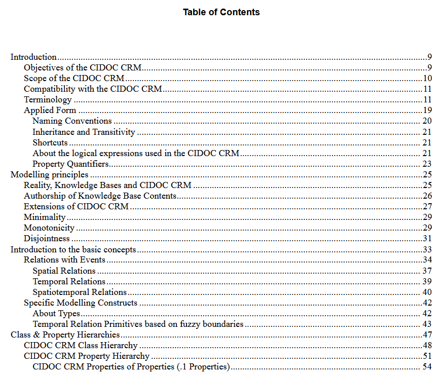

<!--
author: Canan Hastik (0000-0003-1729-4642)

author: Gudrun Schwenk ()

email: c.hastik@igsd-ev.de

email: g.schwenk@igsd-ev.de

version:  v1

language: DE

icon: https://raw.githubusercontent.com/soda-collections-objects-data-literacy/liascript-oers/refs/heads/main/resources/SODa-Logo_full.svg
link: https://raw.githubusercontent.com/soda-collections-objects-data-literacy/SODa_WissKI-ISWC25Bits/refs/heads/main/soda.css

license: CC BY 4.0

comment: Dieser Text erscheint als Info innerhalb der Liascript-Module oben rechts hinter dem (i) und sollte den Inhalt des Moduls kurz beschreiben. Vorschlag: Mirco-Content zum Lernziel "Lernende können FAIR-Prinzipien erläutern". Dieses Modul ist Teil eines Einführungskurses zum Forschungsdatenmanagement, der von “OER.Net UAG FDM-Basiskurs” auf Grundlage der Lernzielmatrix zum FDM entwickelt wurde. Der Basiskurs entwickelt das Konzept der EduBricks weiter und ist als “Arbeitsgruppe 3: Einbettung und Vernetzung des modularen und skalierbaren Konzeptes” zudem Teil der NFDI-Sektion Education and Training.

title: Template für die Erarbeitung eines Micro-Contents anhand eines Lernziels für generischen FDM-Basiskurs

description: Dieses Template wurde als Vorlage für die Entwicklung von Microlearning-Content zum Themenbereich Forschungsdatenmanagement (FDM) in Orientierung an Lernzielen der [Lernzielmatrix zum Forschungsdatenmanagement (FDM)](https://zenodo.org/records/15025246) entwickelt.

keywords: FDM, Forschungsdatenmanagement, Forschungsdaten, Lernziel, Micro-Content

community: Wissenschaftliche Kommunikationsinfrastruktur (WissKI) und Sammlungen, Objekte, Datenkompetenzen (SODa)

PublicationDate: noch unveröffentlicht

LearningResourceType: SODa How-to-Tutorial

-->

# WissKI Bits: Ontologiegestützte Modellierung von Forschungsdaten

**DATENMODELL ENTWICKELN UND IMPLEMENTIEREN AM BEISPIEL** 

Modul 1: **Von der Sammlung über Modellierentscheidungen zum Diagramm – verstehen und erklären**

Einheit 3: **Einführung in CIDOC CRM**  

**Dauer:** ~ 15 Min.

**Lernziele:**

Teilnehmende können...

- Ontologie zur Beschreibung von Ressourcen bennen. (LZ-ID 03\_007\_0778)
- Ontologie zur Beschreibung von Ressourcen erläutern. (LZ-ID 03\_007\_0779)
- Kernentitäten (Objekt/Person/Ort/Zeit/Ereignis) einer Objektsammlung benenen. (LZ-ID SODa\_03\_007\_0806)
- Kernentitäten (Objekt/Person/Ort/Zeit/Ereignis) einer Objektsammlung erläutern. (LZ-ID SODa\_03\_007\_0807)
- Begriff Scope Notes benennen. (LZ-ID SODa\_03\_007\_0837)
- Begriff Scope Notes erläutern. (LZ-ID SODa\_03\_007\_0838)
- Resource Description Framework (RDF) als Standard zur Beschreibung von Ressourcen benennen. (LZ-ID SODa\_03\_007\_0843)
- den Begriff Domänenontologie benennen. (LZ-ID SODa\_03\_007\_0827)
- den Begriff Domänenontologie erläutern. (LZ-ID SODa\_03\_007\_0828)
- Nutzen des Referenzmodells CIDOC CRM benennen. (LZ-ID SODa\_03\_007\_0805)

---

## Was ist CIDOC CRM?

[CIDOC CRM](https://cidoc-crm.org/) ist eine **ISO-zertifizierte Ontologie (ISO 21127)**, entwickelt vom **CIDOC-Komitee der ICOM (International Council of Museums)**.

Es ist **kein technischer Standard**, sondern ein **Papierdokument** ([Release Version 7.1.3 Stand Februar 2024](https://cidoc-crm.org/get-last-official-release)) und wurde speziell für die **Dokumentation kulturellen Erbes** entwickelt. 

Es ist eine **formale Repräsentation** von grundlegenden Konzepten, Begriffen und ihren Beziehungen im Bereich des kulturellen Erbes.

Es ist ein **theoretisches und praktisches Werkzeug** zum Strukturieren, Darstellen und Verstehen **evidenzbasierter Phänomene** aus dem Bereich des kulturellen Erbes. (SIG2026cidoc)

CIDOC CRM umfasst:

- Ereignisse  
- Personen  
- Objekte  
- Orte  
- Zeiträume  
- und deren semantische Beziehungen

**Kurz gesagt:**  

CIDOC CRM bietet einen **gemeinsamen konzeptuellen Rahmen**, um kulturelle Informationen **verständlich und interoperabel** zu beschreiben.

---

## Inhalte und Prinzipien des CIDOC CRM

**CIDOC CRM kennenlernen**

Das CIDOC CRM beschreibt nicht nur Klassen und Properties, sondern erläutert auch **Aufbau, Modellierungsprinzipien und konzeptionelle Grundlagen** des Modells. Für die praktische Arbeit mit dem CIDOC CRM ist es daher hilfreich, sich zunächst mit seiner grundlegenden Struktur vertraut zu machen.

Die offizielle Dokumentation bietet dazu einen umfassenden Einstieg:

> **Abbildung:** Ausschnitt aus dem Inhaltsverzeichnis des CIDOC CRM, [Release Version 7.1.3, Stand Februar 2024](https://cidoc-crm.org/get-last-official-release) (SIG2024cidoc, S.3).

 **Klassen und Properties erkunden**

Für die praktische Modellierung ist es wichtig, die **Klassen und Properties des CIDOC CRM** kennenzulernen. Dafür können neben der offiziellen Dokumentation folgende webbasierte Ressourcen genutzt werden:

- **[CIDOC CRM – Classes & Properties](https://cidoc-crm.org/html/cidoc_crm_v7.1.3.html#E41)**  
  Die offizielle Darstellung der **Version 7.1.3** dient als Referenz zum gezielten Nachschlagen. Sie enthält Definitionen und Scope Notes sowie Informationen zu Klassenhierarchien und Properties.

- **[CIDOC CRM Periodic Table](https://remogrillo.github.io/cidoc-crm_periodic_table/?code=E1)**  
  Die interaktive Darstellung bietet einen **visuellen und explorativen Zugang** zu Klassen, Properties und ihren Zusammenhängen.

> **Hinweis:** Die CIDOC CRM Periodic Table basiert auf **CIDOC CRM 7.1** und entspricht damit nicht vollständig der hier verwendeten Version **7.1.3**.
>
> Nutzt sie daher zur Orientierung und zum Erkunden des Modells. Für die genaue Definition und Verwendung von Klassen und Properties ist die offizielle Dokumentation der Version 7.1.3 maßgeblich.
> 

---

## Zentrale Konzepte in CIDOC CRM

| Konzept          | Beispielklasse (Entity)             | Bedeutung                                |
|-------------------|----------------------------|-------------------------------------------|
| Ding              | **E70 Thing**              | Physisches oder immaterielles Objekt      |
| Physisches Objekt | **E22 Human-Made Object**  | Artefakt, Exponat, Sammlungsobjekt        |
| Akteur            | **E21 Person**, **E74 Group** | Individuum oder Organisation           |
| Ereignis          | **E5 Event**               | Eine Handlung oder Veränderung            |
| Ort               | **E53 Place**              | Räumlicher Kontext                         |
| Zeit              | **E52 Time-Span**          | Zeitlicher Rahmen                          |

> **Quelle:** ([Release Version 7.1.3 Stand Februar 2024](https://cidoc-crm.org/get-last-official-release))

---

## Klassenhierarchie und Scope Notes

Die **Scope Note** einer CIDOC CRM-Klasse legt fest:

- **Was sie ausdrückt**
- **Welche Bedeutung und Grenzen sie hat**
- **Wann sie verwendet werden sollte**

**Achtung: Nicht entscheidend sind:**

- der Name der Klasse (Entity),
- ihre hierarchische Position,
- oder intuitive Assoziationen.

**Scope Notes sind maßgeblich für die korrekte Modellierung.**

---

### Beispiel E39 Actor

> **Abbildung:** Die Abbildung veranschaulicht den Aufbau einer Klassenbeschreibung anhand "E39 Actor" in CIDOC CRM. (SIG2024cidoc, S. 83)

---

## Bedeutung ausdrücken mit CIDOC CRM

CIDOC CRM ist **ereigniszentriert**, d.h. es beschreibt nicht nur, *was etwas ist*, sondern **was mit ihm passiert**. (SIG2024cidoc, S. 33)

Die Aussagen über die Ressourcen haben die Form von **Triples: Subjekt-Prädikat-Objekt**. Die Triples bilden die **Syntax-Grundlage** für formalisierte semantische Datenmodellierung und die technologische Basis, Ontologien (wie CIDOC CRM) in maschinenlesbarer Form darzustellen. 

Das **RDF (Resource Description Framework)** ist ein Standard zur formalen Beschreibung von Aussagen über Ressourcen in From von Triples in WissKI. (W3C2014rdf)

> Beispiel: Zelda-Spiel (SNES)
>
> *Das Videospiel „The Legend of Zelda: A Link to the Past“ wurde 1991 von Nintendo in Kyoto, Japan entwickelt.* (Wikio.D.zelda)

| Natürliche Aussage | CIDOC CRM-Repräsentation |
|--------------------|--------------------------|
| Das Spiel ist ein Objekt. | **E22 Human-Made Object** |
| Der Titel lautet: *The Legend of Zelda: A Link to the Past* | **E22** → *has title* → **E35 Title** |
| Das Spiel wurde prodziert. | **E12 Production** |
| Entwickler und Verleger ist Nintendo. | **E12 Production** → *carried out by* → **E74 Group (Nintendo)** |
| Produktionsort ist Kyoto. | *took place at* → **E53 Place (Kyoto)** |
| Veröffentlichungsjahr ist: 1991 | *has time-span* → **E52 Time-Span (1991)** |

---

## Top-Level- vs. Domänenontologien

Eine **Top-Level Ontologie** beschreibt allgemeine Begriffe wie Zeit, Raum oder Ereignis unabhängig von einem spezifischen Fach- oder Anwendungsbereich oder einer bestimmten Problemstellung. (Rehbein2017ontologies, S. 165)

Eine **Domänenontologie** spezifiert grundlegende Begriffe einer Top-Level-Ontologie für einen bestimmten Fach- oder Anwendungsbereich (Domäne) (Rehbein2017ontologies, S. 166). In einer projekt- oder anwendungsspezifischen Umsetzung werden die für die Domäne relevanten Konzepte, Ereignisse und Beziehungen beschrieben.

| Top-Level Ontologie (Grundstruktur) | Domänenontologie (Fachspezifik) |
|------------------------------------|---------------------------------|
| z.B. **CIDOC CRM** | Erweiterungen, WissKI-Flavors etc. |
| definiert grundlegende Konzepte | Beschreibt fachspezifische Konzepte |
| sorgt für Interoperabilität | erhöht Präzision |
| ist langfristig stabil | ist anpassbar an Forschungsbedarfe |

---

## Relevanz und Nutzen von CIDOC CRM 

WissKI nutzt CIDOC CRM, weil es …

- **eindeutige, maschinenlesbare Bedeutungen** schafft
- **Begriffsmehrdeutigkeit und Datenisolierung** vermeidet
- **institutionenübergreifende Interoperabilität** ermöglicht
- **Ereignisse, Prozesse und Provenienz** systematisch abbildet
- **FAIR & Linked Open Data** unterstützt
- **robustes Fundament** für Wissensgraphen bietet 
- sich vollständig in den **WissKI** integrieren lässt.

---

## Ausblick

CIDOC CRM ist eine ISO-zertifizierte, international entwickelte und etablierte Top-Level-Ontologie für den Bereich des kulturellen Erbes. Als formale Repräsentation grundlegender Konzepte, Eigenschaften und ihrer Beziehungen bietet CIDOC CRM ein wertvolles theoretisches und praktisches Werkzeug, um evidenzbasierte Phänomene des kulturellen Erbes zu strukturieren, darzustellen und zu verstehen. Die Ontologie ist erweiterbar und semantisch ausdifferenzierbar und damit anschlussfähig an Domänenontologien, die aus anwendungs- und projektspezifischen Kontexten der Forschungs- und Sammlungsarbeit hervorgehen. (SIG2024cidoc; Schwenk2025conservation)

In der nächsten Einheit wird die Wissenschaftliche Kommunikationsinfrastruktur WissKI vorgestellt. WissKI wurde speziell für die semantische Erzeugung und Verwaltung von Daten im Kulturerbebereich entwickelt. Die Infrastruktur ist ontologieagnostisch, bietet jedoch eine besondere Unterstützung für die Arbeit mit CIDOC CRM (WissKIo.D.features). 

---

## Bibliografie

[SIG2024cidoc] CIDOC CRM Special Interest Group. (2024). Definition of the CIDOC Conceptual Reference Model: Version 7.1.3. https://cidoc-crm.org/Version/version-7.1.3

[Rehbein2017ontologies] Rehbein, M. (2017). Ontologien. In: F. Jannidis, H. Kohle, & M. Rehbein (Hrsg.), Digital Humanities (S. 162-176). J.B. Metzler, Stuttgart. https://doi.org/10.1007/978-3-476-05446-3_11.

[Schwenk2025conservation] Schwenk , G. A. & Fischer, K. (2025). SODa Forum: Konservierungs- und Restaurierungsdokumentation gemeinsam weiterdenken - Ontologieentwicklung im Dialog. https://doi.org/10.5281/zenodo.15481743

[Wiki2026zelda] Wikipedia (2026) The Legend of Zelda: A Link to the Past. https://de.wikipedia.org/wiki/The_Legend_of_Zelda:_A_Link_to_the_Past

[WissKIo.D.features] WissKI (o. D.). Features. https://wiss-ki.eu/features

[W3C2014rdf] World Wide Web Consortium (W3C). (2014). RDF 1.1 concepts and abstract syntax. https://www.w3.org/TR/rdf11-concepts

