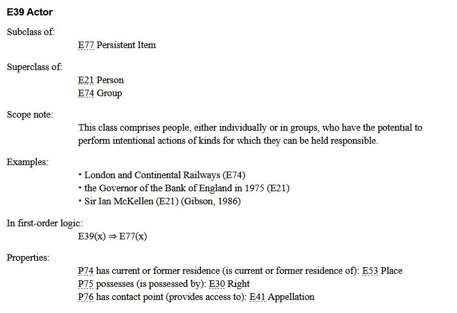

<!--

author: Canan Hastik (0000-0003-1729-4642)

author: Gudrun Schwenk (0009-0002-3156-8339)

email: info@igsd-ev.de

version:  v1.0.0

language: en

icon: https://raw.githubusercontent.com/soda-collections-objects-data-literacy/WissKIBits_How-to-Tutorial/refs/heads/main/assets/SODa-Logo_full.svg

link: https://raw.githubusercontent.com/soda-collections-objects-data-literacy/WissKIBits_How-to-Tutorial/refs/heads/main/soda.css

license: CC BY 4.0 <https://creativecommons.org/licenses/by/4.0/>

comment: This module is part of the how-to tutorial “Ontology-Based Modeling of Research Data”. Using a computer game collection as an example, the tutorial teaches the step-by-step development of a semantic data model based on CIDOC CRM and its implementation with WissKI.

title: WissKI Bits Ontology-Based Modeling of Research Data

module: From the collection through modeling decisions to the diagram – understand and explain

unit: Introduction to CIDOC CRM

description: The SODa how-to tutorial uses a computer game collection as an example to teach the fundamentals and practical steps of ontology-based modeling of research data. Learners develop a semantic data model based on CIDOC CRM and implement it step by step using Protégé, Draw.io, and WissKI.

keywords: WissKI, CIDOC CRM, ontology, domain ontology, semantic modeling, research data, research data management, OER

community: Scientific Communication Infrastructure (WissKI) and Collections, Objects, Data Literacy (SODa)

PublicationDate: 2026-09-09

LearningResourceType: SODa How-to Tutorial

-->

# WissKI Bits: Ontology-Based Modeling of Research Data

**DEVELOPING AND IMPLEMENTING A DATA MODEL USING AN EXAMPLE** 

Module 1: **From the collection through modeling decisions to the diagram – understand and explain**

Unit 3: **Introduction to CIDOC CRM**  

**Duration:** ~ 15 min.

**Learning objectives:**

Participants can...

- name an ontology for describing resources. (LO-ID 03\_007\_0778)
- explain an ontology for describing resources. (LO-ID 03\_007\_0779)
- name the core entities (object/person/place/time/event) of an object collection. (LO-ID SODa\_03\_007\_0806)
- explain the core entities (object/person/place/time/event) of an object collection. (LO-ID SODa\_03\_007\_0807)
- name the term Scope Notes. (LO-ID SODa\_03\_007\_0837)
- explain the term Scope Notes. (LO-ID SODa\_03\_007\_0838)
- name the Resource Description Framework (RDF) as a standard for describing resources. (LO-ID SODa\_03\_007\_0843)
- name the term domain ontology. (LO-ID SODa\_03\_007\_0827)
- explain the term domain ontology. (LO-ID SODa\_03\_007\_0828)
- name the benefits of the CIDOC CRM reference model. (LO-ID SODa\_03\_007\_0805)

---

## What is CIDOC CRM?

[CIDOC CRM](https://cidoc-crm.org/) is an **ISO-certified ontology (ISO 21127)** developed by the **CIDOC Committee of ICOM (International Council of Museums)**.

It is **not a technical standard**, but a **paper document** ([Release Version 7.1.3, February 2024](https://cidoc-crm.org/get-last-official-release)) and was developed specifically for the **documentation of cultural heritage**. 

It is a **formal representation** of fundamental concepts, terms, and their relationships in the field of cultural heritage.

It is a **theoretical and practical tool** for structuring, representing, and understanding **evidence-based phenomena** in the field of cultural heritage. (SIG2026cidoc)

CIDOC CRM includes:

- events  
- persons  
- objects  
- places  
- time-spans  
- and their semantic relationships

**In short:**  

CIDOC CRM provides a **common conceptual framework** for describing cultural information in an **understandable and interoperable** way.

> **CIDOC CRM**
>
> ...is an ISO-certified ontology (ISO 21127) developed for the documentation and integration of cultural heritage information.
>
> It provides a common conceptual framework for describing:
>
> **objects · actors · events · places · time-spans · relationships**
>
> Its purpose is to make cultural heritage information explicit, understandable, and interoperable across different collections and systems.
>
> **Important:** CIDOC CRM defines a conceptual model. Machine-readable implementations of the model, such as OWL representations, are used for technical applications.

---

## Content and principles of CIDOC CRM

**Getting to know CIDOC CRM**

CIDOC CRM not only describes classes and properties, but also explains the **structure, modeling principles, and conceptual foundations** of the model. For practical work with CIDOC CRM, it is therefore helpful to first become familiar with its basic structure.

The official documentation provides a comprehensive introduction:

> **Figure:** Excerpt from the table of contents of CIDOC CRM, [Release Version 7.1.3, February 2024](https://cidoc-crm.org/get-last-official-release) (SIG2024cidoc, p. 3).

> **How do we work with CIDOC CRM?**
>
> CIDOC CRM consists not only of classes and properties.
>
> Its documentation also explains the structure, meaning, and modeling principles of the model.
>
> For practical modeling, we therefore need to understand both:
> 
> - the elements of the model: Classes and properties
> - the meaning of the elements: Definitions, scope notes, and modeling principles.

---

**Exploring classes and properties**

For practical modeling, it is important to become familiar with the **classes and properties of CIDOC CRM**. In addition to the official documentation, the following web-based resources can be used:

- **[CIDOC CRM – Classes & Properties](https://cidoc-crm.org/html/cidoc_crm_v7.1.3.html)**  
  The official representation of **Version 7.1.3** serves as a reference for targeted lookup. It contains definitions and Scope Notes as well as information on class hierarchies and properties.

- **[CIDOC CRM Periodic Table](https://remogrillo.github.io/cidoc-crm_periodic_table/?code=E1)**  
  The interactive representation provides a **visual and exploratory approach** to classes, properties, and their relationships.

**Note:** The CIDOC CRM Periodic Table is based on **CIDOC CRM 7.1** and therefore does not fully correspond to **Version 7.1.3** used here.

Use it for orientation and for exploring the model. For the precise definition and use of classes and properties, the official documentation for Version 7.1.3 is authoritative.

> **Resources for exploring CIDOC CRM are**
>
> **Official CIDOC CRM documentation Version 7.1.3**: A document for authoritative definitions, scope notes, class hierarchies, and properties. [link](https://cidoc-crm.org/sites/default/files/cidoc_crm_version_7.1.3.pdf)
>
> **CIDOC CRM web-based HTML navigator**: The official representation of **Version 7.1.3** serves as a reference for targeted lookup. [link](https://cidoc-crm.org/html/cidoc_crm_v7.1.3.html)
> 
> **CIDOC CRM Periodic Table**: Use it as a visual tool for exploring classes, properties, and their relationships. [link](https://remogrillo.github.io/cidoc-crm_periodic_table)

---

## Central concepts in CIDOC CRM

| Concept           | Example class (Entity)       | Meaning                                  |
|-------------------|------------------------------|------------------------------------------|
| Thing             | **E70 Thing**                | Physical or immaterial object            |
| Physical object   | **E22 Human-Made Object**    | Artifact, exhibit, collection object     |
| Actor             | **E21 Person**, **E74 Group** | Individual or organization              |
| Event             | **E5 Event**                 | An action or change                      |
| Place             | **E53 Place**                | Spatial context                          |
| Time              | **E52 Time-Span**            | Temporal framework                       |

> **Source:** ([Release Version 7.1.3, February 2024](https://cidoc-crm.org/get-last-official-release))

> **Core entities**
>
> CIDOC CRM provides general classes for describing the central elements of cultural heritage information: **things, objects, actors, events, places, and time-spans**.

---

## Class hierarchy and Scope Notes

The **Scope Note** of a CIDOC CRM class specifies:

- **What it expresses**
- **What its meaning and boundaries are**
- **When it should be used**

**Important: The following are not decisive:**

- the name of the class (Entity),
- its hierarchical position,
- or intuitive associations.

**Scope notes are authoritative for correct modeling.**

> **Scope notes guide modeling decisions**
>
> A scope note explains the intended meaning and use of a CIDOC CRM class or property.
>
> It helps answer:
> 
> - What does this element express?
> - What are its semantic boundaries?
> - When should it be used?
>
> **Key principle**: Do not select a class or property based on its name alone.
>
> Check always its **scope note** to determine whether it expresses the intended meaning.

---

### Example E39 Actor

> **Figure:** The figure illustrates the structure of a class description using “E39 Actor” in CIDOC CRM as an example. (SIG2024cidoc, p. 83)

---

## Expressing meaning with CIDOC CRM

CIDOC CRM is **event-centered**, meaning that it describes not only *what something is*, but also **what happens to it**. (SIG2024cidoc, p. 33)

Statements about resources take the form of **triples: subject–predicate–object**. Triples form the **syntactic basis** for formalized semantic data modeling and the technological basis for representing ontologies (such as CIDOC CRM) in machine-readable form. 

**RDF (Resource Description Framework)** is a standard for the formal description of statements about resources in the form of triples in WissKI. (W3C2014rdf)

 Example: Zelda game (SNES) *The video game “The Legend of Zelda: A Link to the Past” was developed by Nintendo in Kyoto, Japan, in 1991.* (Wikio.D.zelda)

| Natural-language statement | CIDOC CRM representation |
|-----------------------------|--------------------------|
| The game is an object. | **E22 Human-Made Object** |
| The game was produced. | **E12 Production** |
| The developer and publisher is Nintendo. | **E12 Production** → *carried out by* → **E74 Group (Nintendo)** |
| The place of production is Kyoto. | *took place at* → **E53 Place (Kyoto)** |
| The year of publication is: 1991 | *has time-span* → **E52 Time-Span (1991)** |

> **CIDOC CRM is event-centered**
>
> CIDOC CRM describes not only what something is, but also what happened, who was involved, where it happened, and when.
>
> Events connect objects with actors, places, and time-spans.
>
> Example: Object → Event ← Actor

> **Meaning can be expressed as triples**
>
> Semantic statements can be represented as: Subject → Predicate → Object
>
> For example: Production → carried out by → Nintendo
>
> RDF (Resource Description Framework) provides a standard for representing statements about resources as triples in machine-readable form.

> We have to decide between **class alignement or relationships**
>
> Classification: e.g. “The game is an object.” → E22 Human-Made Object, Game → instance of → E22 Human-Made Object
>
> Relationship: e.g. “The title is…” → E22 → has title → E35 Title, Game → has title → Title

---

## Top-level vs. domain ontologies

A **top-level ontology** describes general concepts such as time, space, or events independently of a specific subject or application area or a particular problem. (Rehbein2017ontologies, p. 165)

A **domain ontology** specifies fundamental concepts of a top-level ontology for a particular subject or application area (domain) (Rehbein2017ontologies, p. 166). In a project- or application-specific implementation, the concepts, events, and relationships relevant to the domain are described.

| Top-level ontology (basic structure) | Domain ontology (domain-specific) |
|--------------------------------------|-----------------------------------|
| e.g. **CIDOC CRM** | Extensions, WissKI flavors, etc. |
| defines fundamental concepts | describes domain-specific concepts |
| ensures interoperability | increases precision |
| is stable over the long term | can be adapted to research needs |

> **Reference model and domain-specific model**
>
> A general **reference ontology** provides a shared conceptual framework.
>
> A **domain ontology** adapts and specializes this framework for the concepts and requirements of a particular research domain.
>
> **Note**: In this tutorial, CIDOC CRM provides the common framework, while the computer games domain requires more specific concepts.

---

## Relevance and benefits of CIDOC CRM 

WissKI uses CIDOC CRM because it …

- creates **unambiguous, machine-readable meanings**
- avoids **ambiguity of terms and data silos**
- enables **cross-institutional interoperability**
- systematically represents **events, processes, and provenance**
- supports **FAIR & Linked Open Data**
- provides a **robust foundation** for knowledge graphs
- can be fully integrated into **WissKI**.

> **Why use CIDOC CRM?**
>
> CIDOC CRM provides a shared semantic framework that helps to:
> 
> - make the meaning and relationships of data explicit,
> - represent events, processes, and provenance systematically,
> - connect and compare information across collections and systems, and
> - provide a semantic foundation for machine-readable and reusable research data.
> 
> In this tutorial, CIDOC CRM provides the semantic foundation for the later implementation in WissKI.

---

## Outlook

CIDOC CRM is an ISO-certified, internationally developed and established top-level ontology for the cultural heritage domain. As a formal representation of fundamental concepts, properties, and their relationships, CIDOC CRM provides a valuable theoretical and practical tool for structuring, representing, and understanding evidence-based phenomena of cultural heritage. The ontology can be extended and semantically differentiated, making it compatible with domain ontologies that emerge from application- and project-specific contexts of research and collection work. (SIG2024cidoc; Schwenk2025conservation)

The next unit introduces the Scientific Communication Infrastructure WissKI. WissKI was developed specifically for the semantic creation and management of data in the cultural heritage domain. The infrastructure is ontology-agnostic, but provides particular support for working with CIDOC CRM (WissKIo.D.features). 

> **Next:**
>
>  We now have a reference model for formally describing concepts, events, and relationships in the cultural heritage domain.
>
> In the next unit, we introduce WissKI and explore how ontology-based structures can support the management and use of research data.

---

## Bibliography

[SIG2024cidoc] CIDOC CRM Special Interest Group. (2024). Definition of the CIDOC Conceptual Reference Model: Version 7.1.3. https://cidoc-crm.org/Version/version-7.1.3

[Rehbein2017ontologies] Rehbein, M. (2017). Ontologien. In: F. Jannidis, H. Kohle, & M. Rehbein (Hrsg.), Digital Humanities (S. 162-176). J.B. Metzler, Stuttgart. https://doi.org/10.1007/978-3-476-05446-3_11.

[Schwenk2025conservation] Schwenk, G. A. & Fischer, K. (2025). SODa Forum: Konservierungs- und Restaurierungsdokumentation gemeinsam weiterdenken - Ontologieentwicklung im Dialog. https://doi.org/10.5281/zenodo.15481743

[Wiki2026zelda] Wikipedia (2026) The Legend of Zelda: A Link to the Past. https://de.wikipedia.org/wiki/The_Legend_of_Zelda:_A_Link_to_the_Past

[WissKIo.D.features] WissKI (n.d.). Features. https://wiss-ki.eu/features

[W3C2014rdf] World Wide Web Consortium (W3C). (2014). RDF 1.1 concepts and abstract syntax. https://www.w3.org/TR/rdf11-concepts

