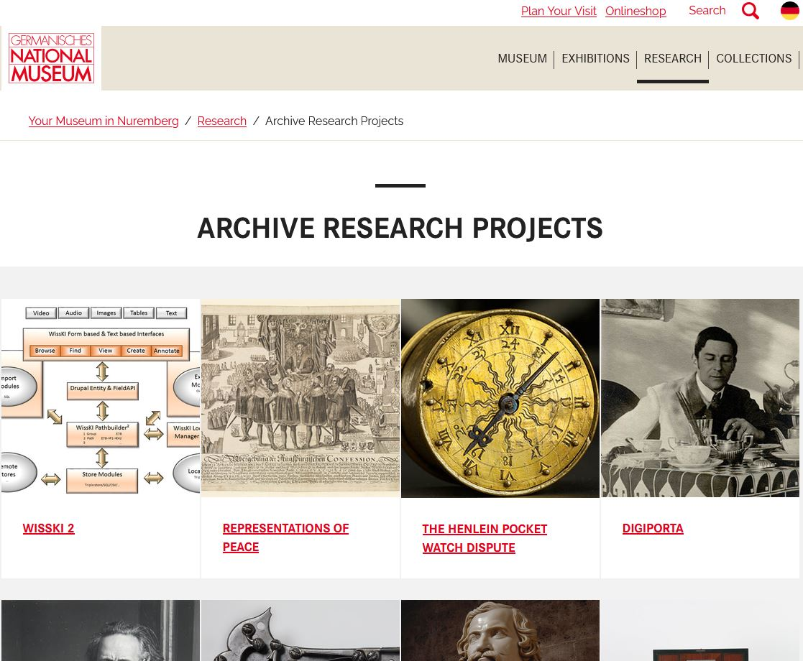
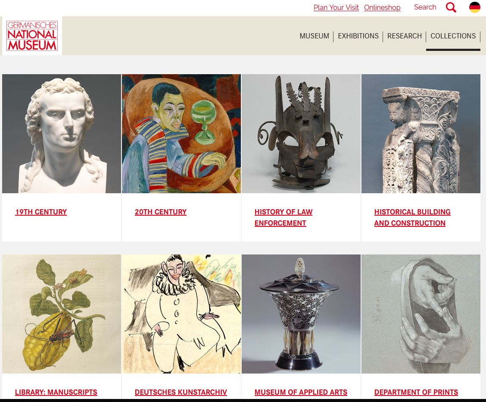
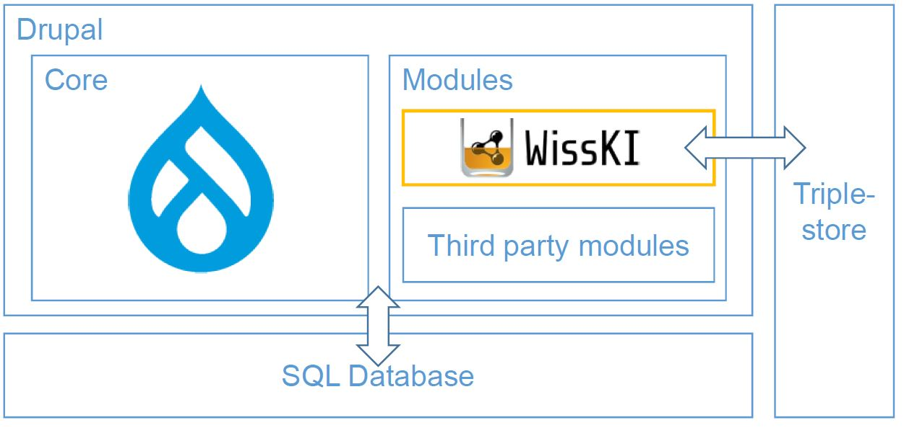
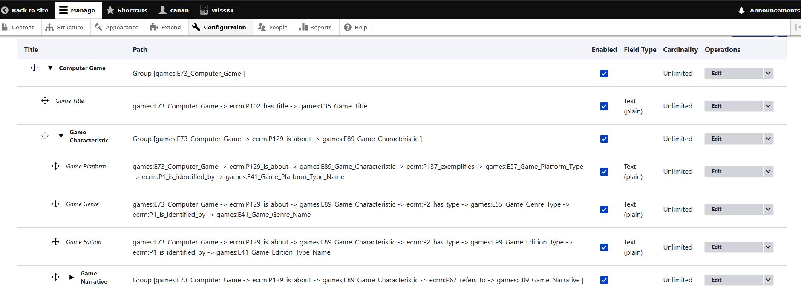

<!--

author: Canan Hastik (0000-0003-1729-4642)

author: Gudrun Schwenk (0009-0002-3156-8339)

email: info@igsd-ev.de

version:  v1.0.0

language: en

icon: https://raw.githubusercontent.com/soda-collections-objects-data-literacy/WissKIBits_How-to-Tutorial/refs/heads/main/assets/SODa-Logo_full.svg

link: https://raw.githubusercontent.com/soda-collections-objects-data-literacy/WissKIBits_How-to-Tutorial/refs/heads/main/soda.css

license: CC BY 4.0 <https://creativecommons.org/licenses/by/4.0/>

comment: This module is part of the how-to tutorial “Ontology-Based Modeling of Research Data”. Using a computer game collection as an example, the tutorial teaches the step-by-step development of a semantic data model based on CIDOC CRM and its implementation with WissKI.

title: WissKI Bits Ontology-Based Modeling of Research Data

module: From the collection through modeling decisions to the diagram – understand and explain

unit: FAIR Compliance with WissKI

description: The SODa how-to tutorial uses a computer game collection as an example to teach the fundamentals and practical steps of ontology-based modeling of research data. Learners develop a semantic data model based on CIDOC CRM and implement it step by step using Protégé, Draw.io, and WissKI.

keywords: WissKI, CIDOC CRM, ontology, domain ontology, semantic modeling, research data, research data management, OER

community: Scientific Communication Infrastructure (WissKI) and Collections, Objects, Data Literacy (SODa)

PublicationDate: 2026-09-09

LearningResourceType: SODa How-to Tutorial

-->

# WissKI Bits: Ontology-Based Modeling of Research Data

**DEVELOPING AND IMPLEMENTING A DATA MODEL USING AN EXAMPLE** 

Module 1: **From the collection through modeling decisions to the diagram – understand and explain**

Unit 4: **FAIR Compliance with WissKI**  

**Duration:** ~ 15 min.

**Learning objectives:**

Participants can...

- explain (inter)national IT infrastructures relevant to collection-related research data management (RDM). (LO-ID SODa\_01\_010\_0203)
- name suitable technologies that support the application of the FAIR principles. (LO-ID 01\_007\_0121)
- name the FAIR principles. (LO-ID 01\_007\_0117)
- name the 5-star model for open data. (LO-ID SODa\_01\_008\_0172)
- name the W3C Web Ontology Language (OWL) as a formal description language. (LO-ID SODa\_03\_007\_0842)
- name Erlangen CRM / OWL as an OWL implementation of the CIDOC CRM reference model. (LO-ID SODa\_03\_007\_0841)
- name the specific functions and application areas of the Scientific Communication Infrastructure WissKI. (LO-ID SODa\_01\_010\_0191a)
- explain the specific functions and application areas of the Scientific Communication Infrastructure WissKI. (LO-ID SODa\_01\_010\_0192a)
- name the capabilities and efficiency of IT infrastructures for collection-related research data management (RDM) using the Scientific Communication Infrastructure WissKI. (LO-ID SODa\_01\_010\_0202)
- name the WissKI Pathbuilder as a tool for defining an ontology structure. (LO-ID SODa\_03\_007\_0803)
- explain the WissKI Pathbuilder as a tool for defining an ontology structure. (LO-ID SODa\_03\_007\_0849)
- explain the event-centered modeling principle using CIDOC CRM with an example. (LO-ID SODa\_03\_007\_0850)
- name the Resource Description Framework (RDF) as a standard for describing resources. (LO-ID SODa\_03\_007\_0843)
- name the benefits of the Scientific Communication Infrastructure WissKI. (LO-ID SODa\_01\_010\_0204)

---

## WissKI in brief

**WissKI** (Scientific Communication Infrastructure) is (WissKIo.D.features):

- a free, open-source virtual research environment
- developed for cultural heritage and research data
- based on Semantic Web technologies
- modular in design and standards-oriented.

> **What is WissKI?**
> WissKI (Scientific Communication Infrastructure) is a free, open-source virtual research environment for cultural heritage and research data.
>
> It combines:
> - ontology-based modeling
> - Semantic Web technologies
> - research data management.
> 
> WissKI enables research and collection data to be structured according to their meaning and relationships, rather than only stored in predefined tables.

---

## FAIR compliance of WissKI

WissKI is **not just** a collection database.

As a **semantic data management system**, it supports Linked Open Data (LOD) and therefore the FAIR principles: **Findable, Accessible, Interoperable, and Reusable** (WissKIo.D.features).

An introduction to LOD is provided by the [**5-star model** for open data](https://5stardata.info/de/), which describes the path from digital documents to linked, machine-readable data (Hausenblast2012lod).

Technologies such as the [Resource Description Framework (RDF)](https://www.w3.org/RDF/) (RDF2014rdf) and the W3C-standardized [**Web Ontology Language (OWL)**](https://www.w3.org/OWL/) (W3C2001owl) make it possible to represent knowledge formally and in machine-readable form and to semantically link data.

As part of its technical foundation, WissKI uses the current version of **[Erlangen CRM / OWL](https://erlangen-crm.org/current-version)** (Schiemann2024crm), an OWL implementation of the current version of the CIDOC Conceptual Reference Model (CIDOC CRM). (SIG2026cidoc)

However, WissKI can also integrate other ontologies, provided that they are available in a machine-readable format such as RDF or OWL.   

This creates interoperable and reusable knowledge resources. Their specific FAIR compliance additionally depends on modeling, licensing, and provision.

> **How does WissKI support FAIR data?**
>
> WissKI supports the FAIR principles: **Findable · Accessible · Interoperable · Reusable**
>
> It uses Semantic Web technologies and standards such as RDF and OWL to represent and connect knowledge in a machine-readable form.
>
> Ontologies such as CIDOC CRM provide shared semantic structures that support interoperability and reuse.
>
> **Important:** Using WissKI can support FAIR data management, but FAIRness also depends on factors such as modeling decisions, metadata, licensing, and data provision.

---

## WissKI at the GNM

WissKI is used, among other places, at the [**Germanisches Nationalmuseum (GNM)**](https://www.gnm.de/) in Nuremberg —

- the largest museum of cultural history in the German-speaking world (GNMo.D.stakeholders)
- which sets standards for digital research infrastructures.
  
The [**How to FAIR**](https://howtofair.dk/what-is-fair/) website (Harm2022fair) explains the **FAIR principles** and shows concrete areas of action for implementing them in research projects. (Reichert2025soda) 

> **Figure:** [Overview page of the research projects archive at the GNM](https://www.gnm.de/forschung/forschungsprojekte-archiv) (GNMo.D.research)

> **Figure:** [Overview page of the collections at the GNM](https://www.gnm.de/sammlungen/ueberblick-sammlungen) (GNMo.D.collections)

> **IN PRACTICE · WissKI at the GNM**
>
> WissKI is used at the Germanisches Nationalmuseum (GNM) in Nuremberg as part of its digital research infrastructure.
>
> This illustrates how semantic technologies can support research and collection data management in an institutional context.

---

## WissKI and Drupal 

WissKI is **not standalone software**, but a set of modules (knurg2025wisski) that semantically extend the [**Drupal**](https://new.drupal.org/) content management system. (Drupal2024core)

> **Figure:** WissKI integration in Drupal (Fichtner2023wisski, p. 2)

> **Drupal + WissKI**
>
> WissKI extends the Drupal content management system with ontology-based and semantic functionality.
>
> Drupal provides:
> - user, role, and rights management
> - access control
> - modular architecture
> - interfaces for users (GUI) and data exchange (REST/JSON)  
> - multilingual support
>
> WissKI adds:
> - ontology-based data structures
> - semantic paths
> - RDF triple store for storing semantic data  
> - SPARQL endpoint for queries and access  
> - Publication as Linked Open Data (LOD)  
> 
> **Together: Drupal provides the application framework; WissKI adds the semantic data layer.**

---

## The WissKI Pathbuilder

The **Pathbuilder** is the **core of WissKI**.

The semantic structures modeled in the Pathbuilder are technically stored in WissKI as an RDF knowledge graph. In this way, WissKI combines user-friendly modeling with Semantic Web standards.

The Pathbuilder defines:

- **Groups** → semantic entities, e.g. object, person, place, event
- **Paths** → relationships between these entities, e.g. object → was created by → person
- **Widgets** → automatically generated input forms whose structure is derived from the semantics

This makes it possible to work in WissKI **not with tables**, but with **ontology-based structures**. 

At the same time, WissKI remains flexible, enables semantic consistency, and provides the best possible support for users in data maintenance.

> **Figure:** Pathbuilder in WissKI with path groups, paths, and field settings for the semantic modeling of the computer games domain

> **What does the Pathbuilder do?**
>
> The WissKI Pathbuilder translates ontology-based structures into paths that can be used for data entry and management in WissKI.
> 
> Groups organize semantic entities such as objects, persons, places, or events.
> Paths define semantic relationships between these entities.
> Widgets / fields make these structures usable for data entry.
>
> **Ontology → Groups and paths → Data entry → RDF knowledge graph**

---

## Semantic modeling the *WissKI way*

In WissKI, **not only data** are stored and recorded; **meaning** is modeled.

Guiding question: **What real-world relationship exists between the things?**

!?[Video](../WissKIBits_Modul1/assets/semanticModelling.mp4)

> **Video:** How statements of semantic meaning shape a knowledge graph in WissKI and connect relevant information into a network.

- **Albrecht Dürer** → Person  
- was born in → **Nuremberg** (Place)  
- at → **a specific point in time**  
- had a mother → **Barbara Dürer** (Person)  
- created → **Self-Portrait** (Object)
- **Time of creation** mentioned in a **source**
- during → **his artistic creative period**  
- in → **Nuremberg**

The basis for this is the **event-centered modeling principle of CIDOC CRM**: 

Objects are not described in isolation, but are placed in a comprehensible context through **events** (e.g. production, use, acquisition) and the actors, places, and times involved.

Technically, this knowledge graph is based on the Resource Description Framework (RDF). Information is stored as so-called triples:

- Subject – the resource being described
- Predicate – its property or relationship
- Object – a value or another resource

A statement such as: **“The self-portrait was created by Albrecht Dürer.”** is stored as a single, uniquely referenceable relationship. Many such statements connect to form a directed graph that represents complex relationships in a machine-readable way. 

Together, these triples form the knowledge graph managed by WissKI.

The WissKI Pathbuilder translates ontology models based on CIDOC CRM directly into such RDF structures.

Path groups correspond to entities, paths define relationships, and the forms generated from them automatically create consistent statements in the knowledge graph during data entry.

---

## Relevance of WissKI

WissKI...

- enables **knowledge-based modeling** instead of rigid table schemas
- ensures **interoperability** through established ontologies such as **CIDOC CRM**
- supports the **FAIR principles**
- automatically generates **input forms** based on semantic paths
- publishes data as **Linked Open Data**
- provides **powerful SPARQL queries**
- combines **conceptual clarity** with **technical implementation**.

> **Why is WissKI relevant?**
>
> WissKI connects conceptual modeling with technical implementation.
> It supports:
> - ontology-based rather than purely table-based data structures,
> - semantic consistency through shared ontologies,
> - structured data entry based on semantic paths,
> - machine-readable data and semantic queries, and
> - interoperable and reusable research data.

---

## Semantics are central to WissKI

From semantics to usable research data: 

- **CIDOC CRM** defines classes (Entities) and properties (Properties)
- **Semantic paths** translate the model into a usable data structure  
- **Forms** ensure consistent data entry and reduce room for interpretation  
- **RDF knowledge graph** enables exchange, reuse, and LOD publication  

As a result, collection data are not merely documented, but semantically structured so that they remain understandable, interoperable, and machine-readable for analysis over the long term.

---

## Information about WissKI and the WissKI Community (as of August 2026)

- **News, information, and WissKI documentation on the WissKI homepage:** https://wiss-ki.eu/de

  
- **Introductions to WissKI features:**
  - YouTube channel WissKIProjekt: https://www.youtube.com/@wisskiproject
  - YouTube channel WissKI: https://www.youtube.com/@wisski5763

 
- **WissKI documentation**
  - WissKI documentation with tutorial, how-tos, guides, and a glossary: https://project.pages.drupalcode.org/wisski/
  - WissKI module documentation: https://www.drupal.org/docs/extending-drupal/contributed-modules/contributed-module-documentation/wisski

    
- **News and community:**
  - Mattermost: https://chat.wiss-ki.eu/wisski/channels/town-square
  - Mastodon: \@wisski@fedihum.org
  - Facebook: https://www.facebook.com/wisskiproject/
  - WissKICommunity website of Heidelberg University Library: https://sempub.ub.uni-heidelberg.de/wisski_projekte/de

    
- **WissKI User Meeting:** https://wiss-ki.eu/taxonomy/term/63  
  **Annual gathering of the WissKI community** at the Germanisches Nationalmuseum Nürnberg (GNM) to discuss projects and topics together, learn about current developments, and jointly find **solutions to challenges relating to the further development and use of WissKI** (WissKIo.D.events; WissKI2026wat).

> **Further resources · WissKI and the community**
>
> Find further information, documentation, tutorials, community channels, and events through the WissKI website and community resources.

---

## Outlook

**WissKI** provides a technical environment in which semantic data models can be implemented and made usable for working with collection and research data. 

In the following unit, this **modeling process is explored in practice using a concrete example**. The starting point is an **example object from the computer games domain**, which is modeled semantically step by step. The unit brings together the steps introduced so far in the module: from **conceptual knowledge modeling** and the development of a **model sketch**, through the **formalized representation** of the relevant concepts, properties, and relationships using **CIDOC CRM**, to the resulting **domain model** based on CIDOC CRM.

The practical unit thus demonstrates how, starting from a concrete collection object, a formal semantic model can be developed and subsequently transferred into a structured modeling approach.

> Next: We have seen how WissKI connects semantic modeling with technical research data management. In the following practical unit, we return to our example object and develop its semantic domain model step by step using the concepts introduced in this module.

---

## Bibliography

[Drupal2024core] Drupal Association (2024) Drupal 11.4.5 Drupal Core. https://www.drupal.org/project/drupal/releases/11.4.5

[Fichtner2023wisski] Fichtner, M., Nasarek, R., & Wiesing, T. (2023). WissKI: A Virtual Research Environment Based on Drupal. *Proceedings of the Conference on Research Data Infrastructure*, 1. https://doi.org/10.52825/cordi.v1i.353

[GNMo.D.stakeholders] Germanisches Nationalmuseum (GNM) (o. D.). Akteure, Architektur, Abteilungen. https://www.gnm.de/museum

[GNMo.D.research] Germanisches Nationalmuseum (GNM) (o. D.). Forschungsprojekte-Archiv. https://www.gnm.de/forschung/forschungsprojekte-archiv

[GNMo.D.collections] Germanisches Nationalmuseum (GNM) (o. D.). Sammlungen. Von der Archäologie bis ins 20. Jahrhundert. https://www.gnm.de/sammlungen/ueberblick-sammlungen

[Hausenblas2012lod] Hausenblas, M. (2012, Januar 22). *5-star open data* (M. Findeisen, Übers.). https://5stardata.info/de/

[Harm2022fair] Harm Buss, M. C., Bayle Deutz, D., Flindt Holmstrand, K., Væring Larsen, A., & Vlachos E. (2022). How to FAIR. https://howtofair.dk/what-is-fair/

[knurg2025wisski] knurg (2025). Drupal Modul WissKI. https://www.drupal.org/project/wisski

[W3C2001owl] OWL Working Group. (2012, Dezemberg 11). OWL - Web Ontology Language (OWL). World Wide Web Consortium. https://www.w3.org/OWL/

[RDF2014rdf] RDF Working Group. (2014, Februar 25). RDF - Resource Description Framework (RDF). World Wide Web Consortium. https://www.w3.org/RDF/

[Reichert2025soda] Reichert, R., & Hastik, C. (2025, August 7). *SODa Basiskurs zu Erschließung und Forschungsdatenmanagement in Universitätssammlungen. Modul 1*. Zenodo. https://doi.org/10.5281/zenodo.16761352

[SIG2024cidoc] CIDOC CRM Special Interest Group. (2024). Definition of the CIDOC Conceptual Reference Model: Version 7.1.3. https://cidoc-crm.org/Version/version-7.1.3

[WissKIo.D.events] WissKI. (o. D.). WissKI Events. https://wiss-ki.eu/events

[WissKIo.D.features] WissKI. (o. D.). WissKI Features. https://wiss-ki.eu/features

[WissK2026wat] WissKI. (o. D.). WissKI WissKI Anwender*innentreffen (WAT). https://wiss-ki.eu/taxonomy/term/63

