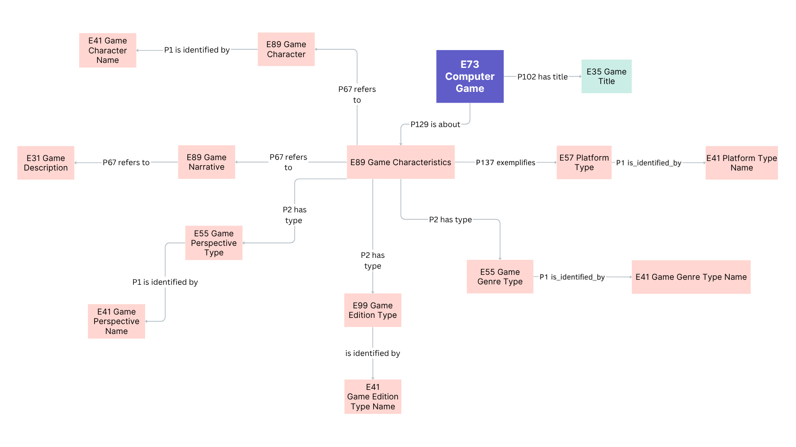

<!--

author: Canan Hastik (0000-0003-1729-4642)

author: Gudrun Schwenk (0009-0002-3156-8339)

email: info@igsd-ev.de

version:  v1.0.0

language: de

icon: https://raw.githubusercontent.com/soda-collections-objects-data-literacy/WissKIBits_How-to-Tutorial/refs/heads/main/assets/SODa-Logo_full.svg

link: https://raw.githubusercontent.com/soda-collections-objects-data-literacy/WissKIBits_How-to-Tutorial/refs/heads/main/soda.css

license: CC BY 4.0 <https://creativecommons.org/licenses/by/4.0/>

comment: Dieses Modul ist Teil des How-to-Tutorials „Ontologiegestützte Modellierung von Forschungsdaten“. Das Tutorial vermittelt am Beispiel einer Computerspielsammlung schrittweise die Entwicklung eines semantischen Datenmodells auf Grundlage des CIDOC CRM und dessen Umsetzung mit WissKI.

title: WissKI Bits Ontologiegestützte Modellierung von Forschungsdaten

module: Von der Sammlung über Modellierentscheidungen zum Diagramm – verstehen und erklären

einheit: Anwendungsbeispiel: Objektsammlungen

description: Das SODa How-to-Tutorial vermittelt am Beispiel einer Computerspielsammlung Grundlagen und praktische Arbeitsschritte der ontologiegestützten Modellierung von Forschungsdaten. Die Lernenden entwickeln ein semantisches Datenmodell auf Grundlage des CIDOC CRM und setzen dieses schrittweise mit Protégé, Draw.io und WissKI um.

keywords: WissKI, CIDOC CRM, Ontologie, Domänenontologie, semantische Modellierung, Forschungsdaten, Forschungsdatenmanagement, OER

community: Wissenschaftliche Kommunikationsinfrastruktur (WissKI) und Sammlungen, Objekte, Datenkompetenzen (SODa)

PublicationDate: 2026-09-09

LearningResourceType: SODa How-to-Tutorial

-->

# WissKI Bits: Ontologiegestützte Modellierung von Forschungsdaten

**DATENMODELL ENTWICKELN UND IMPLEMENTIEREN AM BEISPIEL** 

Modul 1: **Von der Sammlung über Modellierentscheidungen zum Diagramm – verstehen und erklären**

Übungseinheit Ü1: **Anwendungsbeispiel: Objektsammlungen**  

**Dauer:** ~ 30 Min.

**Lernziele:**

Teilnehmende können...

- Kernentitäten (Objekt/Person/Ort/Zeit/Ereignis) einer Objektsammlung anwenden. (LZ-ID SODa\_03\_007\_0811)
- Datentyp-Eigenschaften des Referenzmodells CIDOC CRM benennen. (LZ-ID SODa\_03\_007\_0808) 

---

## Ziel und Szenario

Dies ist eine Praxiseinheit.

Am Beispiel von **„The Legend of Zelda: A Link to the Past“** werden ausgewählte Konzepte probeweise Klassen des **CIDOC CRM** zugeordnet. 

Dabei geht es nicht darum, bereits ein vollständiges oder formal korrektes CIDOC-CRM-Modell zu erstellen. 

Vielmehr soll sichtbar werden, dass die Überführung eines Domänenwissens in ein Referenzmodell **Modellierungsentscheidungen** erfordert.

Am Ende können die Teilnehmenden:

* ausgewählte Konzepte möglichen **CIDOC-CRM-Klassen (Entities)** zuordnen,
* die Zuordnungen als Modellierungsentscheidungen beschreiben,
* ein **konzeptuelles Modell** entwerfen, die als Ausgangspunkt für die weitere Formalisierung dient.

Die Modellskizze wird in den folgenden Modulen 2 und 3 schrittweise weiterentwickelt und für die Arbeit mit **Protégé** und **WissKI** formalisiert.

> **Transfer: Vom konzeptionellen Modell zu CIDOC CRM**
>
> Die in der Aktivierungsübung (M1E1A) entstandene Modellskizze wird nun weiterentwickelt
> 
> Ausgewählte Konzepte und Ereignisse werden mit CIDOC CRM beschrieben 
>
> Dabei geht es nicht darum, bereits ein vollständiges oder endgültiges CIDOC-CRM-Modell zu entwickeln.
>
> Entscheidend ist die Frage:
> **Was meinen wir mit einem Begriff – und welche CIDOC-CRM-Klasse beschreibt diese Bedeutung möglichst passend?**
>
> Ziel ist es, erste Modellierungsentscheidungen zu treffen, zu überprüfen und zu begründen.

---

## Ausgangspunkt: Modellskizze zu „Zelda“

Als Ausgangspunkt ist **„The Legend of Zelda: A Link to the Past“**. 

An diesem Beispiel wurde untersucht, welche **Konzepte, Ereignisse und Beziehungen** für die Beschreibung eines Sammlungsobjekts und seines Kontextes relevant sein können.

> **Von der Modellskizze zum CIDOC CRM Entwurf
>
> Relevante Konzepte, Ereignisse und Beziehungen für das Beispielobjekt **The Legend of Zelda: A Link to the Past** wurden identifiziert (M1E1A).
>
> Nun betrachten Sie diese Modellskizze aus einer neuen Perspektive:
> - Welche Bedeutung haben die identifizierten Konzepte?
> - Welche CIDOC-CRM-Klassen könnten diese Bedeutung ausdrücken?
> - Passen die frei formulierten Beziehungen bereits zum Referenzmodell?
> - Welche Modellierungsentscheidungen müssen getroffen werden?
>
> Denken Sie daran: Eine ähnliche Bezeichnung bedeutet nicht automatisch dieselbe Bedeutung.

---

## CIDCO CRM als Referenzmodell

> **CIDOC CRM als Orientierung**
>
> CIDOC CRM stellt allgemeine Klassen und Eigenschaften für die Beschreibung von Kulturerbeinformationen bereit.
>
> Für die Modellierung bedeutet das:
>
> Domänenkonzept → Bedeutung klären → CIDOC CRM prüfen → Modellierungsentscheidung treffen
>
> Die Bezeichnung einer Klasse allein reicht für die Auswahl nicht aus. Entscheidend ist, ob ihre Scope Note zur beabsichtigten Bedeutung des Domänenkonzepts passt.

--

## Fokus dieser Modellierungsübung

Für die Modellskizze betrachten wir ausgewählte Informationen zum Beispielobjekt. Dabei konzentrieren wir uns auf drei Bereiche:

- **Spieltitel** 
- **Spielmerkmale** (z.B. Genre, wie Action-Adventure, RPG oder Plattform, wie Nintendo 64, PlayStation, PC)
- **narrative Elemente** (z.B. Beschreibung, Perspektive, wie First-Person, Third-Person oder Figuren wie Zelda)

Diese Bereiche dienen als Ausgangspunkt, um unterschiedliche Arten von **Konzepten und Ereignissen** zu erkennen und ihre **Beziehungen** zu formulieren.

Beispielsweise können folgende Fragen gestellt werden:

- Welchen **Titel** hat das Spiel?
- Welchem **Genre** oder welcher **Plattform** wird es zugeordnet?
- Welche **Personen oder Organisationen** waren beteiligt?
- Welche **Ereignisse** sind für das Spiel relevant?
- An welchen **Orten** und zu welchen **Zeiten** fanden diese Ereignisse statt?#

> **Die Bedeutung festlegen**
> 
> Wählen Sie aus Ihrer Modellskizze einige zentrale Elemente aus und fragen Sie:
> - Was genau bezeichnet unser Begriff?
> - Handelt es sich um ein Objekt, einen Informationsinhalt, eine Person, eine Gruppe, ein Ereignis, eine Benennung oder einen Typ?
> - Welche CIDOC-CRM-Klasse könnte dazu passen?
> - Was sagt die Scope Note dieser Klasse?
> - Entspricht sie tatsächlich der Bedeutung, die wir ausdrücken möchten?
> - Wo bleiben Unsicherheiten oder alternative Modellierungen?

---

## Übung – Orientierung mit CIDOC CRM

**Arbeitsform:** Breakout-Räume / Einzelarbeit oder Teams (2–5 Personen)  

**Material:** Papier & Stift (oder digitales Whiteboard)  

**Zeit:** 20 Minuten

### Ausgangslage: Modellskizze 

> **Abbildung:** Die Abbildung zeigt ein Musterbeispiel zur schrittweisen konzeptuellen Erschließung eines Sammlungs- oder Forschungsobjekts am Beispiel des Spiels „The Legend of Zelda: A Link to the Past“. Eigene Darstellung, erstellt mit ChatGPT (OpenAI), 2026.

---

> **Schritt 1 · Auswählen**
>
> Wählen Sie zwei Konzepte oder Ereignisse aus Ihrer Modellskizze aus, z. B. Spiel, Person, Organisation, Titel, Genre oder Produktion.
>
> **Schritt 2 · Zuordnen**
>
> Suchen Sie für jedes ausgewählte Element eine CIDOC-CRM-Klasse, die zu seiner Bedeutung passen könnte.
>
> **Beispiele für mögliche Ausgangspunkte:**
> - E73 Information Object → Spiel als Informationsinhal
> - E22 Human-Made Object → physische Kopi
> - E21 Person → beteiligte Perso
> - E74 Group → Organisation oder Grupp
> - E12 Production → Produktionsereigni
> - E35 Title → Tite
> - E42 Identifier → Identifikato
> - E55 Type → kontrollierte Klassifikation
>
> **Schritt 3 · Überprüfen**
>
> Lesen Sie die Scope Note der ausgewählten Klasse.
>
> Fragen Sie:
> Beschreibt diese Klasse tatsächlich das, was wir mit unserem Begriff meinen?
>
> **Schritt 4 · Begründen**
>
> Ergänzen Sie die CIDOC-CRM-Klasse in Ihrer Modellskizze und notieren Sie kurz, warum Sie diese Zuordnung gewählt haben.
>
> Markieren Sie unsichere Zuordnungen mit einem ?.
>
> **Tipp: Es geht nicht darum, möglichst viele Klassen zuzuordnen. Entscheidend ist, dass Sie wenige Modellierungsentscheidungen nachvollziehbar begründen können.**

---

### Aufgabe 1: Erste Zuordnung zu CIDOC CRM

Schaut euch eure Modellskizze noch einmal an und wählt **zwei Begriffe** daraus aus, z. B. Spiel, Person, Organisation, Titel oder Genre.

Sucht für jeden Begriff nach einer **CIDOC CRM Klasse**, die zu Bedeutung der Begriffe passen könnte.

Begründet kurz eure Klassenauswahl.

**Hinweis:**

> Es geht noch nicht darum, eine vollständige oder endgültige CIDOC-CRM-Modellierung zu erstellen.
> Entscheidend ist zunächst die Frage: Was meinen wir mit unserem Begriff – und welche Klasse beschreibt diese Bedeutung möglichst passend?

**Mini-Demo: CIDOC CRM als Baukasten** 

Für den Einstieg können beispielsweise folgende Klassen hilfreich sein:

| CIDOC CRM Klasse (Entity) | Bedeutung im Beispiel |
|------------------|-----------------------|
| **E73 Information Object** | Spiel als identifizierbarer Informationsinhalt |
| **E22 Human-Made Object** | physische Kopie (Cartridge, Disc, Box…) |
| **E21 Person** | Beteiligte Person / Mitwirkende (Designer:in, Musikeer:in) |
| **E74 Group** | Organisation oder Gruppe (Entwicklerstudio, Publisher, Team) |
| **E12 Production** | Herstellung / (ggf. Veröffentlichung als Ereignis) |
| **E42 Identifier** | Identifikatoren (Inventarnummern, Produktcodes …) |
| **E35 Title** | Titel des Objektes als eigene Entität |
| **E42 Appellation** | Benennung, durch die etwas identifiziert oder bezeichnet wird |
| **E55 Type** | kontrollierte Merkmale (z. B. Genre, Plattform) |

Der [CIDOC CRM Navigator Version 7.1.3 ](https://cidoc-crm.org/html/cidoc_crm_v7.1.3.html) ermöglicht die interaktive Erkundung von 81 Klassen und 160 Eigenschaften, inklusive Übersetzungen. 

---

### Aufgabe 2: Ergebnisbesprechung im Plenum

***Musterbeispiel: Vom Domänenmodell zur CIDOC-CRM-Modellierung***

Die in der Übung entstandene Modellskizze beschreibt zunächst die Konzepte, Ereignisse und Beziehungen der Beispieldomäne. Im nächsten Schritt können diese Elemente mit Klassen (Entities) und Eigenschaften (Properties) des CIDOC CRM weiter formalisiert werden.

Die folgende Abbildung zeigt beispielhaft, wie aus einer solchen Modellskizze ein stärker formalisiertes semantisches Modell entstehen kann:

> **Abbildung:** Die Abbildung zeigt ein Musterbeispiel einer Mindmap zum Computerspiel „The Legend of Zelda: A Link to the Past“.

Dabei werden aus den zunächst frei formulierten Elementen und Beziehungen schrittweise CIDOC-CRM-Klassen und -Eigenschaften. Die Abbildung ist daher nicht als einzig mögliche Lösung zu verstehen, sondern als Modellierungsvorschlag, der überprüft und weiterentwickelt werden kann.

**Hinweis:** 

> Semantische Modellierung bedeutet nicht nur, passende Klassen zu finden.
> Modellierungsentscheidungen machen explizit, welche Bedeutung wir einem Begriff geben und welche Zusammenhänge unsere Daten ausdrücken sollen.

---

### Ergebnis

Sie haben Ihre erste konzeptionelle Modellskizze zu einem CIDOC-CRM-orientierten semantischen Modell weiterentwickelt.

**Die Skizze enthält nun:**

- ausgewählte Domänenkonzepte und Ereignisse,
- erste Zuordnungen zu CIDOC-CRM-Klassen,
- explizite semantische Beziehungen,
- begründete Modellierungsentscheidungen und
- gegebenenfalls markierte offene Fragen.

---

## Von der Benennung zur Appellation

In unserer ersten Modellskizze können wir zunächst einfach formulieren:

> Spiel → hat eine Benennung → „The Legend of Zelda: A Link to the Past“

CIDOC CRM ermöglicht es, eine solche Benennung genauer zu modellieren. E41 Appellation bezeichnet eine Benennung, mit der eine Instanz einer CRM-Klasse identifiziert oder bezeichnet werden kann.

Für Titel gibt es mit E35 Title eine speziellere Klasse: E35 Title ist eine Unterklasse von E41 Appellation. Ein Titel ist damit eine besondere Form einer Appellation.

Vereinfacht können wir unterscheiden:

> E41 Appellation
> → allgemeine Benennung
>
> E35 Title
> → besondere Form einer Appellation: ein Titel
>
> E42 Identifier
> → besondere Form einer Appellation: ein Identifikator

Damit wird deutlich: Begriffe wie Benennung, Titel und Identifikator sind in CIDOC CRM nicht dasselbe, stehen aber in einem gemeinsamen konzeptionellen Zusammenhang.

**Merksatz**

> Bevor wir eine Klasse festlegen, ist zu überprüfen, ob die Scope Note der CIDOC CRM Klasse der Bedeutung des Konzeptbegriffs des Domänenmodells entspricht.

Die genaue Modellierung von Appellationen, ihren Zeicheninhalten und Datentyp-Eigenschaften wird in Modul 3 behandelt.

> **Modellierbeispiel · Nicht jede Benennung ist dasselbe**
>
> In der konzeptionellen Modellskizze können wir zunächst formulieren:
>
> Spiel → hat Benennung → “The Legend of Zelda: A Link to the Past”
>
> CIDOC CRM erlaubt eine genauere Unterscheidung:
> E41 Appellation: allgemeine Benennung
> ↓
> E35 Title: besondere Form einer Appellation: ein Titel
> E42 Identifier: besondere Form einer Appellation: ein Identifikator
>
> **Merksatz: Prüfen Sie vor der Auswahl einer Klasse, ob ihre Scope Note der Bedeutung des Konzepts in Ihrem Domänenmodell entspricht.**

---

## Ausblick

In dieser Praxiseinheit wurde zunächst eine **erste Modellskizze für die Domäne Computerspiele** entwickelt. Anschließend wurde dese Modellierung auf die entsprechenden **Klassen und Eigenschaften des CIDOC CRM** abgebildet und insbesondere die Besonderheiten der **Klasse E41 Appellation** erläutert. 

Als Ergebnis liegt ein **formalisiertes semantisches Modell der Domäne Computerspiele auf Grundlage des CIDOC CRM** vor (siehe Musterlösung).

In **Modul 2** wird das entwickelte Modell mit **Protégé** als maschinenlesbare **OWL-Ontologie** umgesetzt und für die spätere Implementierung in **WissKI** vorbereitet. Auf diese Weise werden die Grundlagen für die praktische Arbeit mit Protégé und die Überführung des semantischen Modells in eine technische Implementierung geschaffen.

In **Modul 3** wird schließlich gezeigt, wie die zuvor entwickelte Modellierung in WissKI umgesetzt wird. Im Mittelpunkt steht dabei die Übertragung des Modells in die **Pfadstruktur des WissKI Pathbuilders**.

> Die in E1A entwickelte konzeptionelle Modellskizze wurde nun um erste CIDOC-CRM-Zuordnungen und begründete Modellierungsentscheidungen erweitert.
> In Modul 2 wird dieses Modell mit Protégé weiter formalisiert und als maschinenlesbare Ontologiestruktur umgesetzt. In Modul 3 wird die Modellierung anschließend in eine für den WissKI Pathbuilder nutzbare Struktur überführt.

---

## Bibliografie

[SIG2024cidoc] CIDOC CRM Special Interest Group. (2024). Definition of the CIDOC Conceptual Reference Model: Version 7.1.3. https://cidoc-crm.org/Version/version-7.1.3

[SIG2024cidocb] CIDOC CRM Special Interest Group. (2024). Classes & Properties Declarations of CIDOC-CRM version: 7.1.3. https://cidoc-crm.org/html/cidoc_crm_v7.1.3.html

