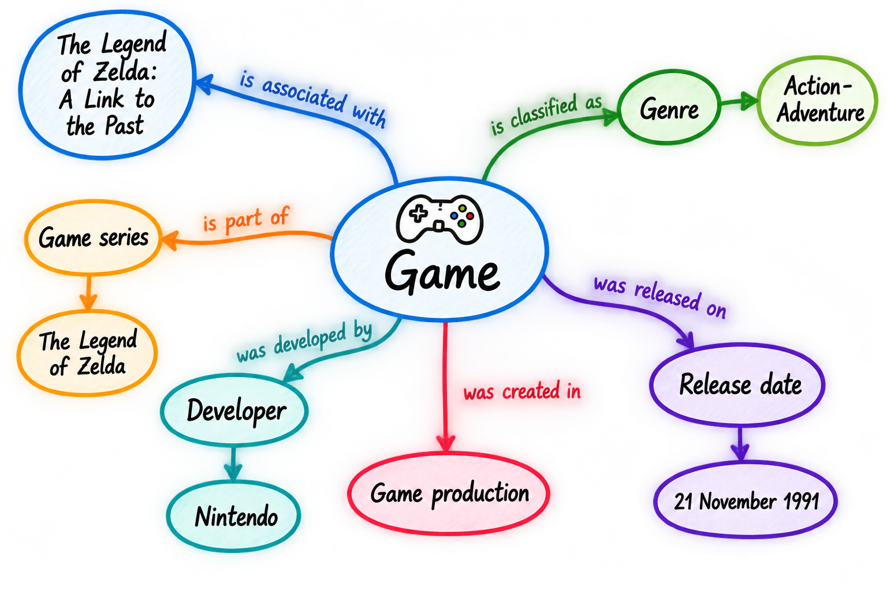

<!--

author: Canan Hastik (0000-0003-1729-4642)

author: Gudrun Schwenk (0009-0002-3156-8339)

email: info@igsd-ev.de

version:  v1.0.0

language: en

icon: https://raw.githubusercontent.com/soda-collections-objects-data-literacy/WissKIBits_How-to-Tutorial/refs/heads/main/assets/SODa-Logo_full.svg

link: https://raw.githubusercontent.com/soda-collections-objects-data-literacy/WissKIBits_How-to-Tutorial/refs/heads/main/soda.css

license: CC BY 4.0 <https://creativecommons.org/licenses/by/4.0/>

comment: This module is part of the how-to tutorial “Ontology-Based Modeling of Research Data”. Using a computer game collection as an example, the tutorial teaches the step-by-step development of a semantic data model based on CIDOC CRM and its implementation with WissKI.

title: WissKI Bits Ontology-Based Modeling of Research Data

module: From the collection through modeling decisions to the diagram – understand and explain

unit: Application Example: Object Collections

description: The SODa how-to tutorial uses a computer game collection as an example to teach the fundamentals and practical steps of ontology-based modeling of research data. Learners develop a semantic data model based on CIDOC CRM and implement it step by step using Protégé, Draw.io, and WissKI.

keywords: WissKI, CIDOC CRM, ontology, domain ontology, semantic modeling, research data, research data management, OER

community: Scientific Communication Infrastructure (WissKI) and Collections, Objects, Data Literacy (SODa)

PublicationDate: 2026-09-09

LearningResourceType: SODa How-to Tutorial

-->

# WissKI Bits: Ontology-Based Modeling of Research Data

**DEVELOPING AND IMPLEMENTING A DATA MODEL USING AN EXAMPLE** 

Module 1: **From the collection through modeling decisions to the diagram – understand and explain**

Exercise Unit E1E: **Application Example: Object Collections**  

**Duration:** ~ 20 min.

**Learning objectives:**

Participants can...

- apply the core entities (object/person/place/time/event) of an object collection. (LO-ID SODa\_03\_007\_0811)
- name datatype properties of the CIDOC CRM reference model. (LO-ID SODa\_03\_007\_0808) 

---

## Objective and Scenario

This is a practical exercise.

we use **"The Legend of Zelda: A Link to the Past"** as an example, select some concepts and we will tentatively map them to **CIDOC CRM** classes.

The aim here is not to create a complete or formally correct CIDOC CRM model.

Rather, the goal is to demonstrate that translating domain knowledge into a reference model requires **modeling decisions**.

By the end, we will be able to:

*   map selected concepts to potential **CIDOC CRM classes (entities)**,
*   describe these mappings as modeling decisions,
*   design a **conceptual model** that serves as a starting point for further formalization.

This model sketch will be progressively refined in the subsequent modules (2 and 3) and later formalised for use with **Protégé** and **WissKI**.

> **Transfer: From Conceptual Model to CIDOC CRM**
>
> The model sketch created during the activation exercise (M1E1A) is now being further developed.
>
> Selected concepts and events are described using CIDOC CRM.
>
> The aim here is not to develop a complete or final CIDOC CRM model at this stage.
>
> The crucial question is:
> 
> **What do we mean by a specific term—and which CIDOC CRM class best captures that meaning?**
>
> The goal is to make, review, and justify initial modeling decisions.

---

## Starting Point: Example Object “Zelda”

The computer game **“The Legend of Zelda: A Link to the Past”** serves as the starting point. 

Using this example, we examine which **concepts, events, and relationships** may be relevant for describing a collection object and its context.

The **goal is not** to develop a complete data model for computer games. Instead, an **initial model sketch** is created that

- distinguishes central concepts and events in a way that is understandable to people,
- makes their relationships visible, and
- serves as the basis for subsequent mapping to **CIDOC CRM**.

---

## Starting Point: Model Sketch for “Zelda”

The starting point is **“The Legend of Zelda: A Link to the Past”**.

We use this example, an analysis was conducted to determine which **concepts, events, and relationships** might be relevant for describing a collection object and its context.

> **From Model Sketch to CIDOC CRM Draft**
>
> Relevant concepts, events, and relationships for the example object **“The Legend of Zelda: A Link to the Past”** have been identified (M1E1A).
>
> Now, consider this model sketch from a new perspective:
> 
> - What is the significance of the identified concepts?
> - Which CIDOC CRM classes could express this significance?
> - Do the informally phrased relationships already align with the reference model?
> - What modeling decisions need to be made?
>
> Remember: A similar label does not automatically imply the same meaning.

---

## CIDOC CRM as a Reference Model

> **CIDOC CRM as a Guide**
>
> CIDOC CRM provides general classes and properties for describing cultural heritage information.
>
> For modeling, this means:
>
> Domain concept → Clarify meaning → Check CIDOC CRM → Make modeling decision
>
> The name of a class alone is not sufficient for selection. The decisive factor is whether its scope note aligns with the intended meaning of the domain concept.

--

## Focus of this Modeling Exercise

For the model sketch, we consider selected information regarding the example object. In doing so, we focus on three areas:

- **Game title**
- **Game characteristics** (e.g., genre, such as action-adventure, RPG, or platform, such as Nintendo 64, PlayStation, PC)
- **Narrative elements** (e.g., description, perspective—such as first-person or third-person—or characters like Zelda)

These areas serve as a starting point for identifying various types of **concepts and events** and formulating the **relationships** between them.

For example, the following questions might be asked:

- What is the **title** of the game?
- To which **genre** or **platform** is it assigned?
- Which **people or organizations** were involved?
- Which **events** are relevant to the game?
- At which **locations** and **times** did these events take place?

> **Defining the meaning**
> 
> Select a few key elements from your model sketch and ask:
> 
> - What exactly does our term denote?
> - Is it an object, a piece of information, a person, a group, an event, a name, or a type?
> - Which CIDOC CRM class might fit?
> - What does that class's scope note say?
> - Does it actually correspond to the meaning we wish to convey?
> - Where do uncertainties or alternative modeling approaches remain?

---

## Exercise – Getting Oriented with CIDOC CRM

**Format:** Breakout rooms / Individual work or teams (2–5 people)

**Materials:** Paper & pen (or digital whiteboard)

**Time:** 20 minutes

### Starting Point: Model Sketch

> **Figure:** The figure shows an example of the step-by-step conceptual analysis of a collection or research object, using the game *The Legend of Zelda: A Link to the Past* as a case study. Author's own illustration, created with ChatGPT (OpenAI), 2026.

---

> **Step 1 · Select**
>
> We select concepts or events from the model sketch, e.g., Game, Person, Organization, Title, Genre, or Production.
>
> **Step 2 · Assign**
>
> For each selected element, we find a CIDOC CRM class that could match its meaning.
>
> Use:
> 
> **Official CIDOC CRM documentation Version 7.1.3**: A document for authoritative definitions, scope notes, class hierarchies, and properties. [link](https://cidoc-crm.org/sites/default/files/cidoc_crm_version_7.1.3.pdf)
>
> **CIDOC CRM web-based HTML navigator**: The official representation of **Version 7.1.3** serves as a reference for targeted lookup. [link](https://cidoc-crm.org/html/cidoc_crm_v7.1.3.html)
> 
> **CIDOC CRM Periodic Table**: Use it as a visual tool for exploring classes, properties, and their relationships. [link](https://remogrillo.github.io/cidoc-crm_periodic_table)
>
> **Examples of possible starting points:**
> 
> - E73 Information Object → Game as information content
> - E22 Human-Made Object → Physical copy
> - E21 Person → Participating person
> - E74 Group → Organization or group
> - E12 Production → Production event
> - E35 Title → Title
> - E42 Identifier → Identifier
> - E55 Type → Controlled classification
>
> **Step 3 · Review**
>
> We read the scope note of the selected class.
>
> We ask: Does this class actually describe what we mean by our term?
>
> **Step 4 · Justify**
>
> We add the CIDOC CRM class to your model sketch and briefly note why you chose this assignment.
>
> We mark uncertain assignments with a question mark (?).
>
> **Tip: The goal is not to assign as many classes as possible. The crucial point is that you can provide a clear and understandable justification for a few modeling decisions.**

---

### Task 1: Initial Mapping to CIDOC CRM

Take another look at your model sketch and select **two terms** from it—for example, game, person, organization, title, or genre.

For each term, look for a **CIDOC CRM class** that might correspond to the term's meaning.

Briefly justify your choice of class.

**Note:**

> The goal at this stage is not to create a complete or final CIDOC CRM model.
> The crucial question to start with is: What do we mean by our term—and which class describes that meaning most appropriately?

**Mini-Demo: CIDOC CRM as a Building-Block System**

To get started, the following classes might be helpful, for example:

| CIDOC CRM class (Entity) | Meaning in the example |
|--------------------------|------------------------|
| **E73 Information Object** | Game as identifiable information content |
| **E22 Human-Made Object** | Physical copy (cartridge, disc, box…) |
| **E21 Person** | Participating person / contributor (designer, musician) |
| **E74 Group** | Organization or group (development studio, publisher, team) |
| **E12 Production** | Production / (possibly publication as an event) |
| **E42 Identifier** | Identifiers (inventory numbers, product codes …) |
| **E35 Title** | Title of the object as a separate entity |
| **E42 Appellation** | Name by which something is identified or designated |
| **E55 Type** | Controlled characteristics (e.g. genre, platform) |

The [CIDOC CRM Navigator Version 7.1.3](https://cidoc-crm.org/html/cidoc_crm_v7.1.3.html) enables interactive exploration of 81 classes and 160 properties, including translations. 

--- 

### Task 2: Plenary Discussion of Results

***Example: From Domain Model to CIDOC CRM Modeling***

The model sketch created during the exercise initially describes the concepts, events, and relationships of the example domain. In the next step, these elements can be further formalized using CIDOC CRM classes (entities) and properties.

The following figure illustrates how such a model sketch can evolve into a more formalized semantic model:

> **Figure:** The figure shows an example of a mind map for the video game "The Legend of Zelda: A Link to the Past."

In this process, the initially loosely formulated elements and relationships are gradually transformed into CIDOC CRM classes and properties. Consequently, the figure should not be viewed as the only possible solution, but rather as a modeling proposal that can be reviewed and further developed.

**Note:**

> Semantic modeling involves more than just finding suitable classes.
> Modeling decisions make explicit the meaning we assign to a term and the connections our data are intended to express.

---

### Result

You have further developed your initial conceptual model sketch into a CIDOC-CRM-oriented semantic model.

**The sketch now includes:**

- selected domain concepts and events,
- initial mappings to CIDOC-CRM classes,
- explicit semantic relationships,
- substantiated modeling decisions, and
- any open questions that have been flagged.

---

## From Designation to Appellation

In our initial model sketch, we can state simply:

> Game → has a designation → “The Legend of Zelda: A Link to the Past”

CIDOC CRM allows for a more precise modeling of such a designation. **E41 Appellation** refers to a designation used to identify or refer to an instance of a CRM class.

For titles, there is a more specific class: **E35 Title** is a subclass of E41 Appellation. A title is thus a specific form of an appellation.

In simplified terms, we can distinguish between:

> E41 Appellation
> → general designation
>
> E35 Title
> → specific form of an appellation: a title
>
> E42 Identifier
> → specific form of an appellation: an identifier

This makes it clear that terms such as designation, title, and identifier are not identical in CIDOC CRM, though they share a common conceptual context.

**Key Point**

> Before assigning a class, verify whether the CIDOC CRM class's scope note corresponds to the meaning of the concept in your domain model.

The precise modeling of appellations, their character content, and datatype properties is covered in Module 3.

> **Modeling Example · Not All Designations Are the Same**
>
> In the conceptual model sketch, we can initially state:
>
> Game → has designation → “The Legend of Zelda: A Link to the Past”
>
> CIDOC CRM allows for a more precise distinction:
> E41 Appellation: general designation
> ↓
> E35 Title: specific form of an appellation: a title
> E42 Identifier: specific form of an appellation: an identifier
>
> **Key Point: Before selecting a class, check whether its scope note matches the meaning of the concept in your domain model.**

---

## Outlook

In this practical session, an **initial model sketch for the computer games domain** was first developed. Subsequently, this model was mapped to the corresponding **classes and properties of the CIDOC CRM**, with particular emphasis on explaining the specific characteristics of the **E41 Appellation class**.

The result is a **formalized semantic model of the computer games domain based on the CIDOC CRM** (see sample solution).

In **Module 2**, the developed model will be implemented using **Protégé** as a machine-readable **OWL ontology** and prepared for subsequent implementation in **WissKI**. This establishes the foundation for practical work with Protégé and the transition of the semantic model into a technical implementation.

Finally, **Module 3** demonstrates how the previously developed model is implemented in **WissKI**. The focus here is on transferring the model into the **path structure of the WissKI Pathbuilder**.

> The conceptual model sketch developed in E1A has now been expanded to include initial CIDOC CRM mappings and substantiated modeling decisions.
> In Module 2, this model will be further formalized using Protégé and implemented as a machine-readable ontology structure. In Module 3, the model will then be converted into a structure compatible with the WissKI Pathbuilder.

---

## Bibliography

[SIG2024cidoc] CIDOC CRM Special Interest Group. (2024). Definition of the CIDOC Conceptual Reference Model: Version 7.1.3. https://cidoc-crm.org/Version/version-7.1.3

[SIG2024cidocb] CIDOC CRM Special Interest Group. (2024). Classes & Properties Declarations of CIDOC-CRM version: 7.1.3. https://cidoc-crm.org/html/cidoc_crm_v7.1.3.html

