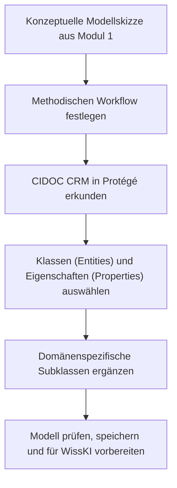

<!--
author: Canan Hastik (0000-0003-1729-4642)

author: Gudrun Schwenk (0009-0002-3156-8339)

email: c.hastik@igsd-ev.de

email: g.schwenk@igsd-ev.de

version:  v1

language: DE

icon: https://raw.githubusercontent.com/soda-collections-objects-data-literacy/liascript-oers/refs/heads/main/resources/SODa-Logo_full.svg
link: https://raw.githubusercontent.com/soda-collections-objects-data-literacy/SODa_WissKI-ISWC25Bits/refs/heads/main/soda.css

license: CC BY 4.0

comment: Dieses Modul ist Teil des SODa How-to-Tutorials „Ontologiegestützte Modellierung von Forschungsdaten“. Das Tutorial vermittelt am Beispiel einer Computerspielsammlung schrittweise die Entwicklung eines semantischen Datenmodells auf Grundlage des CIDOC CRM und dessen Umsetzung mit WissKI.

title: WissKI Bits: Ontologiegestützte Modellierung von Forschungsdaten

module: Modellieren mit CIDOC CRM – verstehen und anwenden

einheit: Willkommen, Zielsetzung und Ablauf

description: Das SODa How-to-Tutorial vermittelt am Beispiel einer Computerspielsammlung Grundlagen und praktische Arbeitsschritte der ontologiegestützten Modellierung von Forschungsdaten. Die Lernenden entwickeln ein semantisches Datenmodell auf Grundlage des CIDOC CRM und setzen dieses schrittweise mit Protégé, Draw.io und WissKI um.

keywords: WissKI, CIDOC CRM, Ontologie, Domänenontologie, semantische Modellierung, Forschungsdaten, Forschungsdatenmanagement, OER

community: Wissenschaftliche Kommunikationsinfrastruktur (WissKI) und Sammlungen, Objekte, Datenkompetenzen (SODa)

PublicationDate: 2026-09-04

LearningResourceType: SODa How-to-Tutorial

-->

# WissKI Bits: Ontologiegestützte Modellierung von Forschungsdaten

**DATENMODELL ENTWICKELN UND IMPLEMENTIEREN AM BEISPIEL** 

Modul 2: **Modellieren mit CIDOC CRM – verstehen und anwenden**

Einheit 0: **Willkommen, Zielsetzung und Ablauf**  

**Dauer:** ~ 10 Min.

---

## Begrüßung

> Willkommen zu **WissKI Bits: Ontologiegestützte Modellierung von Forschungsdaten**.
>
> Dieses How-to-Tutorial führt praxisorientiert in die ontologiegestützte Modellierung von Forschungsdaten ein. Ausgehend von Informationen zu einem Sammlungsobjekt wird schrittweise ein semantisch aussagekräftiges Datenmodell entwickelt und für die spätere Implementierung in WissKI vorbereitet.
>
> Modul 2 **„Modellieren mit CIDOC CRM – verstehen und anwenden“** führt den Lernweg von Modul 1 fort. Das konzeptuelle Domänenmodell wird mit einer systematisch überprüft und mithilfe von CIDOC CRM und Protégé formalisiert. Dabei werden Modellierungsentscheidungen nicht nur getroffen, sondern anhand von Scope Notes fachlich begründet und in einer maschinenlesbaren Ontologiestruktur umgesetzt.
>
> Das Modul folgt weiterhin dem Prinzip **Learning by Doing**. Am Beispiel aus der Domäne Computerspiele wird gezeigt, wie aus einer Modellskizze eine formale Ontologiestruktur entsteht. Die Teilnehmenden lernen Protégé als Ontologie-Editor kennen, erkunden eine OWL-Implementierung des CIDOC CRM und erweitern diese um ausgewählte domänenspezifische Konzepte.
>
> Das Ergebnis bildet die Grundlage für die anschließende Implementierung der Ontologiestruktur und der semantischen Pfade im WissKI Pathbuilder.

---

## Zielsetzung des Moduls

In Modul 2 wird das konzeptuelle Domänenmodell aus Modul 1 in Protégé mit CIDOC CRM formalisiert.

- Methoden zur Entwicklung von Ontologien werden vorgestellt, verglichen und auf das Beispiel bezogen. ???
- Ein schrittweiser Workflow für die semantische Modellierung wird benannt und angewendet.
- Protégé wird als Software zur Erstellung und Bearbeitung von Ontologien eingeführt.
- Eine bestehende OWL-Implementierung des CIDOC CRM wird geladen und in ihrer Struktur erkundet.
- Konzepte aus der Modellskizze werden anhand der Scope Notes geeigneten Klassen (Entities) und Eigenschaften (Properties) des CIDOC CRM zugeordnet.
- Domänenspezifische Konzepte werden als Subklassen ergänzt und in die vorhandene Klassenhierarchie eingeordnet.
- Objekt- und Datentyp-Eigenschaften werden unterschieden und im Modell verwendet.
- Die erweiterte Ontologie wird gespeichert und für die weitere Umsetzung in WissKI vorbereitet.
  
---

## Leitfrage

> **Wie wird aus einer konzeptuellen Modellskizze eine fachlich begründete und maschinenlesbare Ontologiestruktur auf Basis von CIDOC CRM?**

Diese Leitfrage begleitet alle Einheiten des Moduls. Dabei wird zwischen drei Arbeitsschritten unterschieden:

| Arbeitsschritt | Leitfrage | Ergebnis |
|---|---|---|
| Methodisch planen | Welche Schritte und Modellierungsentscheidungen sind erforderlich? | Modellierungsworkflow |
| Formal umsetzen | Wie werden  Klassen (Entities) und Eigenschaften (Properties) in Protégé angelegt oder wiederverwendet? | Formale Ontologiestruktur |
| Fachlich prüfen | Passen die gewählten CIDOC-CRM-Elemente gemäß ihren Scope Notes zur beabsichtigten Aussage? | Begründetes und konsistentes Modell |

---

## Ablauf des Moduls

**Gesamtdauer Modul 2: ca. 90 Min.**

| Einheit | Inhalt | Dauer |
|---|---|---:|
| 0 | Willkommen, Zielsetzung und Ablauf | 10 Min. |
| 1 | Methoden und Workflows semantischer Modellierung | 5 Min. |
| 2 | Einführung in Protégé | 20 Min. |
| Ü | Semantische Modellierung mit CIDOC CRM | 55 Min. |
|  | **Gesamt** | **90 Min.** |

  
---

## Lernziele des Moduls

Nach Abschluss von Modul 2 können die Teilnehmenden…

### 1. Methoden und Workflows semantischer Modellierung

- Methoden zur Entwicklung von Ontologien benennen. (LZ-ID 03\_007\_0784)
- Methoden zur Entwicklung von Ontologien erläutern. (LZ-ID SODa\_03\_007\_0839)
- einen Workflow für die semantische Modellierung als Datendokumentation benennen. (LZ-ID SODa\_03\_001\_0626)
- einen Workflow für die semantische Modellierung als Datendokumentation erläutern. (LZ-ID SODa\_03\_001\_0853)
- Methoden zur Modellierung einer Domänenontologie mit dem Referenzmodell CIDOC CRM benennen. (SODa\_03\_007\_0784a)
- Methoden zur Modellierung einer Domänenontologie mit dem Referenzmodell CIDOC CRM erläutern. (SODa\_03\_007\_0785a)

### 2. Einführung in Protégé

- Software zur Erstellung von Ontologien benennen. (LZ-ID SODa\_03\_007\_0809)
- Software zur Erstellung von Ontologien erläutern. (LZ-ID SODa\_03\_007\_0810)
- Erlangen CRM / OWL als OWL-Implementierung des Referenzmodells CIDOC CRM benennen. (LZ-ID SODa\_03\_007\_0841)
- Software zur Erstellung von Ontologien anwenden. (LZ-ID SODa\_03\_007\_0840)
- Methoden zur Modellierung einer Domänenontologie mit dem Referenzmodell CIDOC CRM benennen. (LZ-ID SODa\_03\_007\_0784a)
- Methoden zur Modellierung einer Domänenontologie mit dem Referenzmodell CIDOC CRM erläutern. (SODa\_03\_007\_0785a)

### Ü. Semantische Modellierung mit CIDOC CRM

- Ontologie zur Beschreibung von Ressourcen anwenden. (LZ-ID 03\_007\_0780)
- Methoden zur Entwicklung von Ontologien anwenden. (LZ-ID SODa\_03\_007\_0854)
- einen Workflow für die semantische Modellierung als Datendokumentation anwenden (LZ-ID SODa\_03\_001\_0627)
- unter Anleitung Methoden zur Modellierung einer Domänenontologie mit dem Referenzmodell CIDOC CRM anwenden. (LZ-ID SODa\_03\_001\_0786a) 
- Software zur Erstellung von Ontologien anwenden. (LZ-ID SODa_03_007_0840)
- Erlangen CRM / OWL als OWL-Implementierung des Referenzmodells CIDOC CRM anwenden. (LZ-ID SODa_03_007_0855)
- Scope Notes des Referenzmodells CIDOC CRM zur Beschreibung von Ressourcen anwenden. (LZ-ID SODa\_03\_007\_0780a)

---

## Lernweg im Modul

> **Abbildung:** Die Grafik veranschaulicht den Lernweg des Moduls.

---

## Arbeitsweise und Beispiel

Das Modul verbindet methodischen Input, Demonstration und angeleitete Anwendung:

- Die Teilnehmenden lernen grundlegende Methoden und einen iterativen Workflow der Ontologieentwicklung kennen.
- Die Bedienoberfläche und die zentralen Bereiche von Protégé werden in einer Live- oder Video-Demonstration vorgestellt.
- Die OWL-Implementierung **[Erlangen CRM](https://erlangen-crm.org/current-version)** in der aktuellen Version (Schiemann2024crm), wird geladen und anhand ihrer Klassen, Objekteigenschaften und Datentyp-Eigenschaften erkundet.
- Das Beispielobjekt **„The Legend of Zelda: A Link to the Past“** und die in Modul 1 entwickelte Modellskizze dienen erneut als roter Faden.
- Ausgewählte Konzepte werden anhand der Scope Notes mit CIDOC CRM abgeglichen.
- Domänenspezifische Konzepte wie Spielmerkmal, Plattformtyp, Genretyp oder Editionstyp werden als Subklassen modelliert.
- Passende Beziehungen zwischen den Konzepten und Ereignissen werden ausgewählt.
- Die Teilnehmenden dokumentieren ihre Entscheidungen und prüfen das Modell schrittweise auf Verständlichkeit und Konsistenz.

Das Ziel ist keine vollständige Domänenontologie. Entscheidend ist eine **kleine, nachvollziehbare und formal nutzbare Erweiterung von CIDOC CRM**, die den Übergang zur Umsetzung in WissKI vorbereitet.

---

## Voraussetzungen

Vorausgesetzt werden die Inhalte aus Modul 1 oder vergleichbare Grundkenntnisse, wie beispielweise eine eigenes semantisches Domänenmodell mit CIDOC CRM. 

Die Teilnehmenden sollten…

- die Begriffe Domäne, Konzept, Ereignis und Beziehung unterscheiden können,
- die Bausteine  Klassen (Entities), Eigenschaften (Properties), Instanz (Instances) und Modellannahme (Assumptions) kennen,
- das Grundprinzip der ereigniszentrierten Modellierung mit CIDOC CRM verstanden haben,
- Scope Notes als Grundlage für Modellierungsentscheidungen kennen,
- sowie wenigstens eine erste konzeptuelle Modellskizze im Idealfall ein CIDOC CRM basiertes semantisches Domänenmodell mitbringen.

Für die praktische Anwendung wird ein Computer entweder mit installiertem **Protégé Desktop** oder ein Account für **WebProtégé** benötigt. 
Zwischen beidem kann auf der Webseite der [Stanford Universität](https://protege.stanford.edu/software) gewählt werden. (Stanfordo.D.protege) 

Außerdem muss die im Tutorial verwendete **OWL-Datei des Erlangen CRM** lokal verfügbar oder über eine Webadresse erreichbar sein.

---
 
## Ergebnis des Moduls

Am Ende von Modul 2 liegt eine erste formal umgesetzte Domänenontologie beziehungsweise Ontologieerweiterung vor. 

Sie enthält:

- ausgewählte und fachlich begründete  Klassen (Entities) und Eigenschaften (Properties) des CIDOC CRM,
- domänenspezifische Subklassen für zentrale Konzepte des Beispiels,
- mindestens eine modellierte semantische Beziehung zwischen den ausgewählten Klassen,
- mindestens eine sinnvoll eingesetzte Datentyp-Eigenschaft,
- sowie eine Dokumentation zentraler Modellierungsentscheidungen anhand der Scope Notes.

Die Ontologie wird als OWL-Datei gespeichert und bildet die Grundlage für die anschließende technische Einbindung und Pfadmodellierung in WissKI.

---

## Ausblick

Im folgenden Modul wird die in Protégé erstellte beziehungsweise erweiterte Ontologie in WissKI eingebunden. Auf ihrer Grundlage werden im WissKI Pathbuilder Gruppen und semantische Pfade angelegt und für die strukturierte Erfassung von Forschungsdaten nutzbar gemacht.

---

## Redaktionelle Hinweise

- Die Zeitplanung ist auf insgesamt 90 Minuten abgestimmt und kann je nach Umfang der praktischen Übung angepasst werden.
- Für Krakau fallen weg:  (Krakau half day = 3,5 Std - Modul 1-3 = 4,5 Std - es fehlen dann noch 10 Min.)

  a. 5 Min in E2 (installieren von Protege und selbstständiges Laden von CIDOC CRM / OWL

  b. 45 Min. M2Ü komplett

  
  
 
