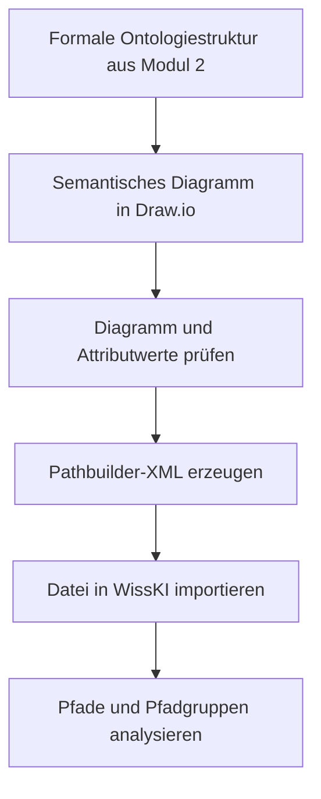

<!--
author: Canan Hastik (0000-0003-1729-4642)

author: Gudrun Schwenk ()

email: c.hastik@igsd-ev.de

email: g.schwenk@igsd-ev.de

version:  v1

language: DE

icon: https://raw.githubusercontent.com/soda-collections-objects-data-literacy/liascript-oers/refs/heads/main/resources/SODa-Logo_full.svg
link: https://raw.githubusercontent.com/soda-collections-objects-data-literacy/SODa_WissKI-ISWC25Bits/refs/heads/main/soda.css

license: CC BY 4.0

comment: Dieser Text erscheint als Info innerhalb der Liascript-Module oben rechts hinter dem (i) und sollte den Inhalt des Moduls kurz beschreiben. Vorschlag: Mirco-Content zum Lernziel "Lernende können FAIR-Prinzipien erläutern". Dieses Modul ist Teil eines Einführungskurses zum Forschungsdatenmanagement, der von “OER.Net UAG FDM-Basiskurs” auf Grundlage der Lernzielmatrix zum FDM entwickelt wurde. Der Basiskurs entwickelt das Konzept der EduBricks weiter und ist als “Arbeitsgruppe 3: Einbettung und Vernetzung des modularen und skalierbaren Konzeptes” zudem Teil der NFDI-Sektion Education and Training.

title: Template für die Erarbeitung eines Micro-Contents anhand eines Lernziels für generischen FDM-Basiskurs

description: Dieses Template wurde als Vorlage für die Entwicklung von Microlearning-Content zum Themenbereich Forschungsdatenmanagement (FDM) in Orientierung an Lernzielen der [Lernzielmatrix zum Forschungsdatenmanagement (FDM)](https://zenodo.org/records/15025246) entwickelt.

keywords: FDM, Forschungsdatenmanagement, Forschungsdaten, Lernziel, Micro-Content

community: Wissenschaftliche Kommunikationsinfrastruktur (WissKI) und Sammlungen, Objekte, Datenkompetenzen (SODa)

PublicationDate: noch unveröffentlicht

LearningResourceType: SODa How-to-Tutorial

-->

# WissKI Bits: Ontologiegestützte Modellierung von Forschungsdaten

**DATENMODELL ENTWICKELN UND IMPLEMENTIEREN AM BEISPIEL** 

Modul 3: **Vom Diagramm zu Pfaden – erläutern und anwenden**

Einheit 0: **Willkommen, Zielsetzung und Ablauf**

**Dauer:** ~ 8 Min.

---

## Begrüßung

> Willkommen zu **SODa WissKI Bits: Ontologiegestützte Modellierung von Forschungsdaten**.
>
> Dieses How-to-Tutorial führt praxisorientiert in die ontologiegestützte Modellierung von Forschungsdaten ein. Ausgehend von Informationen zu einem Sammlungsobjekt wird schrittweise ein semantisch aussagekräftiges Datenmodell entwickelt und für die Nutzung in WissKI implementiert.
>
> In Modul 1 wurde aus Objektdaten und Kontextinformationen eine konzeptuelle Modellskizze entwickelt. In Modul 2 wurde diese Skizze methodisch überprüft und mit CIDOC CRM und Protégé als formale Ontologiestruktur umgesetzt.
>
> Modul 3 **„Vom Diagramm zu Pfaden – erläutern und anwenden“** führt diesen Lernweg in die technische Implementierung: Das semantische Datenmodell wird in Draw.io als formal strukturiertes Diagramm visualisiert. Anschließend wird das Diagramm mithilfe des Webdienstes **„Draw.io diagrams to WissKI pathbuilders“** geprüft und in eine WissKI-Pathbuilder-XML-Datei transformiert.
>
> Die erzeugte Datei wird in WissKI importiert. Dort werden die Pfade und Pfadgruppen analysiert und als Grundlage für die strukturierte Erfassung, Speicherung und Abfrage von Forschungsdaten vorbereitet.
>
> Das Modul folgt dem Prinzip **Learning by Doing**. Am Beispiel aus der Domäne Computerspiele vollziehen die Teilnehmenden die gesamte Verarbeitungskette vom semantischen Diagramm über die Dateikonvertierung bis zur importierten Pfadstruktur im WissKI Pathbuilder nach.

---

## Zielsetzung des Moduls

In Modul 3 wird die in Modul 2 formalisierte Domänenontologie in eine für WissKI nutzbare Pfadstruktur überführt.

* Die Domänenontologie wird in Draw.io als semantisches Diagramm visualisiert.
* Klassen, Eigenschaften und vollständige semantische Pfade werden nach festgelegten Modellierungsregeln dargestellt.
* Für die Konvertierung benötigte Attributwerte werden an den relevanten Diagrammelementen ergänzt und geprüft.
* Das Diagramm wird als Draw.io-XML-Datei für die weitere Verarbeitung bereitgestellt.
* Der Webdienst **„Draw.io diagrams to WissKI pathbuilders“** wird zur Prüfung und Konvertierung des Diagramms eingesetzt.
* Aus dem Diagramm wird eine WissKI-Pathbuilder-XML-Datei erzeugt.
* Die domänenspezifische Ontologie und die erzeugte Pfadstruktur werden in WissKI eingebunden.
* Die importierten Pfade und Pfadgruppen werden analysiert und auf ihre fachliche und strukturelle Plausibilität geprüft.

---

## Leitfrage

> **Wie wird aus einem semantischen Datenmodell eine valide und in WissKI nutzbare Struktur aus Pfaden und Pfadgruppen?**

Diese Leitfrage begleitet alle Einheiten des Moduls. Dabei wird zwischen drei Verarbeitungsschritten unterschieden:

| Verarbeitungsschritt | Leitfrage | Ergebnis |
|---|---|---|
| visualisieren | Wie werden Klassen, Eigenschaften und Pfade eindeutig in Draw.io dargestellt? | formalisiertes Diagramm |
| transformieren | Wie wird das Diagramm geprüft und in das Pathbuilder-Format konvertiert? | Pathbuilder-XML-Datei |
| implementieren und prüfen | Wie wird die Datei in WissKI importiert und die erzeugte Pfadstruktur analysiert? | nutzbarer WissKI Pathbuilder |

---

## Ablauf des Moduls

**Gesamtdauer Modul 3: ca. 90 Min.**

| Einheit | Inhalt | Dauer |
|---|---|---:|
| 0 | Willkommen, Zielsetzung und Ablauf | 8 Min. |
| 1 | Semantische Datenmodelle visualisieren | 37 Min. |
| 2 | Transformation semantischer Modelle mit gnm-service | 40 Min. |
| E | Ergebnissicherung, Transfer und Feedback | 5 Min. |
|  | **Gesamt** | **90 Min.** |

---

## Lernziele des Moduls

Nach Abschluss von Modul 3 können die Teilnehmenden…

### 1. Semantische Datenmodelle visualisieren

- Software zur Visualisierung einer Domänenontologie benennen. (LZ-ID SODa\_03\_007\_0812)
- Software zur Visualisierung einer Domänenontologie erläutern. (LZ-ID LZ-ID SODa\_03\_007\_0813)
- Begriff Visualisierung erläutern. (LZ-----xxxxx)
- Nutzen von Visualisierungen erläutern. (LZ----xxxxx)
- Nutzen einer Software zur Visualisierung einer Domänenontologie benennen. (LZ-ID SODa\_03\_007\_0814) 
- Software zur Visualisierung einer Domänenontologie unter Anleitung anwenden. (LZ-ID SODa\_03\_007\_0815)
- Kernentitäten (Objekt/Person/Ort/Zeit/Ereignis) einer Objektsammlung benennen. (LZ----xxxxx)
- Kernentitäten (Objekt/Person/Ort/Zeit/Ereignis) einer Objektsammlung anwenden. (LZ-ID SODa\_03\_007\_0811)
- Regeln zur Modellierung einer Domänenontologie mit einer Visualisierungssoftware benennen. (LZ-ID SODa\_03\_007\_0820)
- Regeln zur Modellierung einer Domänenontologie mit einer Visualisierungssoftware anwenden. (LZ-ID SODa\_03\_007\_0816)
- Attributwerte an vordefinierten Klassen der Domänenontologie in einer Visualisierungssoftware anwenden. (LZ-ID SODa\_03\_007\_0817)

### 2. Transformation semantischer Modelle mit gnm-service

- WissKI Pathbuilder als Werkzeug zur Defintion einer Ontologiestruktur erläutern. (LZ-ID SODa\_03\_007\_0804)
- unter Anleitung die Datenkonvertierung einer Visualisierungssoftware in ein nachnutzbares Dateiformat anwenden. (LZ-ID SODa\_02\_005\_0298a)
- unter Anleitung WissKI Pathbuilder als Werkzeug zum Import einer domänenspezifischen Ontologiestruktur (Pathbuilder-XML-Datei im WissKI-Pathbuilder) anwenden. (LZ-ID SODa\_03\_007\_0818)
- unter Anleitung die importierte domänenspezifische Ontologiestruktur im WissKI-Pathbuilder analysieren. (LZ-ID SODa\_03\_007\_0819)
- ein Werkzeug ("gnm-service: Draw.io diagrams to WissKI pathbuilders") zur Dateikonvertierung benennen. (LZ-ID SODa\_02\_005\_0317) 
- unter Anleitung ein Werkzeug ("gnm-service: Draw.io diagrams to WissKI pathbuilders") zur Dateikonvertierung anwenden. (LZ-ID SODa\_02\_005\_0318)

### 3. Vom Pathbuilder zur Wissensbasis

- die Struktur eines WissKI-Pathbuilders erläutern;
- Pathbuilder und Ontologie miteinander in Beziehung setzen;
- die Auswirkungen von Modellierungsentscheidungen auf Dateneingabe und -abfrage erläutern;
- die Eignung eines Datenmodells für konkrete Forschungsfragen beurteilen;
- den Zusammenhang zwischen Modellierung, Datenqualität und FAIR-Prinzipien erläutern.

---

## Lernweg im Modul

---

## Arbeitsweise und Beispiel

Das Modul verbindet Aktivierung, angeleitete Modellierung, technische Transformation und Ergebniskontrolle:

- Zu Beginn werden Forschungs- und Abfragefragen aus der Sammlungsperspektive aufgegriffen: Welche Informationen sollen später über semantische Pfade auffindbar und abfragbar sein?
- Das Beispielobjekt **„The Legend of Zelda: A Link to the Past“** und die in den vorherigen Modulen entwickelte Domänenontologie dienen erneut als roter Faden.
- In Draw.io vervollständigen die Teilnehmenden ein vorbereitetes Diagramm um fehlende Klassen und Eigenschaften.
- Sie prüfen vollständige Pfade, Knoten-Kanten-Verbindungen, Benennungen und die für die Konvertierung benötigten Attributwerte.
- Das Diagramm wird als XML-Datei an den Konvertierungsdienst übergeben.
- Die erzeugte Pathbuilder-XML-Datei wird in WissKI importiert.
- Abschließend werden Pfade und Pfadgruppen mit dem Ausgangsdiagramm und den fachlichen Abfragewünschen verglichen.

Das Ziel ist nicht die vollständige technische Konfiguration einer WissKI-Instanz. Entscheidend ist eine **nachvollziehbare und wiederholbare Verarbeitungskette**, die das semantische Modell in eine nutzbare WissKI-Pfadstruktur überführt.

---

## Voraussetzungen

Vorausgesetzt werden die Inhalte aus Modul 1 und Modul 2 oder vergleichbare Grundkenntnisse und Arbeitsergebnisse. Die Teilnehmenden sollten …

- Konzepte, Ereignisse und Beziehungen einer Domäne identifizieren können,
- Klassen, Objekt- und Datentyp-Eigenschaften unterscheiden können,
- mit dem ereigniszentrierten Modellierungsprinzip und ausgewählten Elementen des CIDOC CRM vertraut sein,
- Scope Notes für Modellierungsentscheidungen nutzen können,
- eine formal umgesetzte Domänenontologie beziehungsweise Ontologieerweiterung kennen,
- sowie das Grundprinzip von semantischen Pfaden verstanden haben.

Für die praktische Anwendung werden benötigt:

- ein Computer mit Internetzugang,
- Zugriff auf Draw.io beziehungsweise diagrams.net,
- die vorbereitete Draw.io-XML-Datei,
- Zugriff auf den Konvertierungsdienst,
- Zugang zu einer vorbereiteten WissKI-Instanz,
- sowie die im Tutorial verwendete Domänenontologie und Referenzontologie.

---

## Ergebnis des Moduls

Am Ende von Modul 3 liegen folgende Arbeitsergebnisse vor:

- ein nach den vorgegebenen Regeln vervollständigtes semantisches Draw.io-Diagramm,
- eine exportierte Draw.io-XML-Datei,
- eine durch den Konvertierungsdienst erzeugte WissKI-Pathbuilder-XML-Datei,
- eine in WissKI importierte Struktur aus Pfaden und Pfadgruppen,
- sowie eine dokumentierte Prüfung der importierten Struktur anhand des Ausgangsmodells und ausgewählter fachlicher Abfragefragen.

Die importierte Pfadstruktur bildet die Grundlage für die Generierung von Bundles, Feldern und Dateneingabeformularen sowie für die anschließende Erfassung und Abfrage semantisch strukturierter Forschungsdaten in WissKI.

---

## Ausblick

Im nächsten Schritt werden aus den importierten Pfaden und Pfadgruppen Eingabestrukturen in WissKI generiert. Anschließend können Beispieldaten erfasst und anhand der zu Beginn formulierten Forschungs- und Abfragefragen geprüft werden. So wird sichtbar, ob das entwickelte Modell die vorgesehenen Informationsbedarfe tatsächlich unterstützt.

---

## Redaktionelle Hinweise

* Die Zeitplanung ist auf insgesamt 90 Minuten abgestimmt. Da beide Facheinheiten praktische Aufgaben enthalten, sollte die Dauer nach einem Testlauf überprüft werden.
* Die Schreibweise von **gnm-service**, der genaue Dienstname und die institutionelle Zuordnung sollten einheitlich festgelegt werden.
* Die Formulierung „syntaktische Gültigkeit anhand der Referenzontologie“ sollte fachlich geprüft werden. Je nach tatsächlichem Prüfungsumfang kann „strukturelle und ontologische Validierung“ präziser sein.
* Die verwendeten Versionen von CIDOC CRM, Erlangen CRM, Domänenontologie, Draw.io-Vorlage und Konvertierungsdienst sollten für eine reproduzierbare Durchführung dokumentiert werden.
* Für die Arbeit in WissKI sind eine vorbereitete Instanz, geeignete Zugriffsrechte und eine vorab getestete Importfunktion erforderlich / bzw Alternative für "Modul-Selbstnutzung"

<!-- alt

## Aktivierung und Input

In Modul 1 wurde festgelegt, welche Information dokumentiert sein sollte. Wir blicken nochmal auf die erste Aktivierungsübung (M1E1) zurück.

[Vorlage öffnen](../assets/M1E1_Aktivierung.docx)

oder 

[Miro Board öffnen]()

**Impulsfrage** 

Welche Fragen fallen euch zu dem Gegenstandsbereich ein und sollten zuverlässig beantworten werden?

**Zuruf im Plenum**

Abfragewünsche werden gesammelt und zur Aktivierungsaufgabe (M1E1) ergänzt:

* „Wir wollen finden…“

---

### Lösungsbeispiele aus dem Spielekontext

_Hilfestellung – nicht vorgeben_

* „… alle Spiele mit einer bestimmten Eigenschaft (z. B. Genre oder Modus).“
* „… alle Spiele, die mit einer bestimmten Person/Organisation verknüpft sind (z. B. Entwickler:in, Studio, Publisher).“
* „… alle Spiele bzw. Spielversionen aus einem Zeitraum X oder einer Region/Plattform Y.“
* „… Spiele mit ähnlichen Merkmalen (z. B. ähnliche Beschreibung, ähnliche Einordnung, ähnliche Eigenschaften).“

---

### Lösungsbeispiele 

* „… alle Objekte mit bestimmter Provenienzstation“
* „… alle Werke einer Person in einer bestimmten Rolle“
* „… alle Ereignisse in Zeitraum X an Ort Y“
* „… Objekte mit ähnlichen Kontextmerkmalen“

**In Pfaden denken**

Schaut noch einmal auf die Modellskizze aus der Modellierungsübung (M1E5) und prüft: 

* "Welche Frage ist beantwortbar? Benennt den/die Pfad/e."
*  "Wo startet die Anfrage?"

---

## Zusammenfassung

Aus dem konzeptuellen Domänenmodell entstehen in Modul 2 formalisierte Pfade, also eine valide domänenspezifische Ontologiestruktur für den WissKI-Pathbuilder, mit der die Fragen beantwortet werden können.

-->
