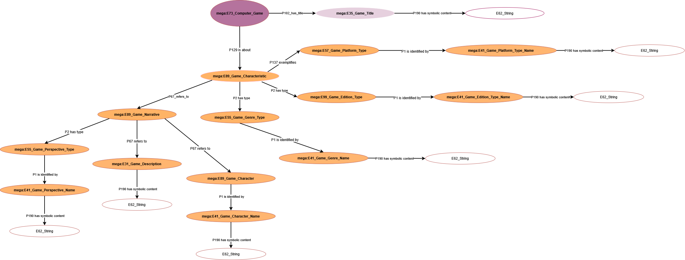

<!--
author: Canan Hastik (0000-0003-1729-4642)

author: Gudrun Schwenk (0009-0002-3156-8339)

email: c.hastik@igsd-ev.de

email: g.schwenk@igsd-ev.de

version:  v1

language: DE

icon: https://raw.githubusercontent.com/soda-collections-objects-data-literacy/liascript-oers/refs/heads/main/resources/SODa-Logo_full.svg
link: https://raw.githubusercontent.com/soda-collections-objects-data-literacy/SODa_WissKI-ISWC25Bits/refs/heads/main/soda.css

license: CC BY 4.0

comment: Dieses Modul ist Teil des SODa How-to-Tutorials „Ontologiegestützte Modellierung von Forschungsdaten“. Das Tutorial vermittelt am Beispiel einer Computerspielsammlung schrittweise die Entwicklung eines semantischen Datenmodells auf Grundlage des CIDOC CRM und dessen Umsetzung mit WissKI.

title: WissKI Bits: Ontologiegestützte Modellierung von Forschungsdaten

module: Vom Diagramm zu Pfaden – erläutern und anwenden

einheit: Semantische Domänenontologie visualisieren

description: Das SODa How-to-Tutorial vermittelt am Beispiel einer Computerspielsammlung Grundlagen und praktische Arbeitsschritte der ontologiegestützten Modellierung von Forschungsdaten. Die Lernenden entwickeln ein semantisches Datenmodell auf Grundlage des CIDOC CRM und setzen dieses schrittweise mit Protégé, Draw.io und WissKI um.

keywords: WissKI, CIDOC CRM, Ontologie, Domänenontologie, semantische Modellierung, Forschungsdaten, Forschungsdatenmanagement, OER

community: Wissenschaftliche Kommunikationsinfrastruktur (WissKI) und Sammlungen, Objekte, Datenkompetenzen (SODa)

PublicationDate: 2026-09-04

LearningResourceType: SODa How-to-Tutorial

-->

# WissKI Bits: Ontologiegestützte Modellierung von Forschungsdaten

**DATENMODELL ENTWICKELN UND IMPLEMENTIEREN AM BEISPIEL** 

Modul 3: **Vom Diagramm zu Pfaden – Erläutern und anwenden**

Einheit Ü1: **Semantische Domänenontologie visualisieren**  

**Dauer:** ~ 35 Min.

**Lernziele:**

Teilnehmende können...

- Software zur Visualisierung einer Domänenontologie benennen. (LZ-ID SODa\_03\_007\_0812)
- Software zur Visualisierung einer Domänenontologie erläutern. (LZ-ID LZ-ID SODa\_03\_007\_0813)
- Begriff Visualisierung erläutern. (LZ-ID SODa\_03\_007\_0851)
- Nutzen von Visualisierungen erläutern. (LZ-ID SODa\_03\_007\_0852)
- Nutzen einer Software zur Visualisierung einer Domänenontologie benennen. (LZ-ID SODa\_03\_007\_0814) 
- Software zur Visualisierung einer Domänenontologie unter Anleitung anwenden. (LZ-ID SODa\_03\_007\_0815)
- Kernentitäten (Objekt/Person/Ort/Zeit/Ereignis) einer Objektsammlung benennen. (LZ-ID SODa\_03\_007\_0806)
- Kernentitäten (Objekt/Person/Ort/Zeit/Ereignis) einer Objektsammlung anwenden. (LZ-ID SODa\_03\_007\_0811)
- Regeln zur Modellierung einer Domänenontologie mit einer Visualisierungssoftware benennen. (LZ-ID SODa\_03\_007\_0820)
- Regeln zur Modellierung einer Domänenontologie mit einer Visualisierungssoftware anwenden. (LZ-ID SODa\_03\_007\_0816)
- Attributwerte an vordefinierten Klassen der Domänenontologie in einer Visualisierungssoftware anwenden. (LZ-ID SODa\_03\_007\_0817)

---

## Visualisierung einer Domänenontologie als Diagramm mit Draw.io

In dieser Einheit wird das in Modul 1 und 2 entwickelte Datenmodell als Diagramm in Draw.io (Ltd2026drawio) visualisiert. 

Das entwickelte Draw.io-Diagramm bildet die **Voraussetzung für die (halb-)automatisierte Pipeline** zur Erstellung eines **WissKI Pathbuilders**.

Das Visualisieren in Draw.io ist somit nicht nur eine **Visualisierungsübung**, sondern gleichzeitig ein **expliziter Modellierungsschritt**, um **Modellierungsentscheidungen zu kommunizieren, auszuhandeln und ein gemeinsames Verständnis über semantische Strukturen zu ermöglichen und zu fördern.**

---

## Begriffsdefinition

**Visualisierung**

Visualisierungen sind bildliche Darstellungen von Sachverhalten, die deren Verständnis befördern sollen. 

"In den Geisteswissenschaften werden Visualisierungen als Illustrationen, als Gedächtnisstützen für bekannte Sachverhalte, bei der Organisation von Wissen, sowie als Erkenntnismittel in der Vermittlung und Erzeugung von (neuem) Wissen eingesetzt." (Freyberg2023visual)

"Zum Lernen sind Visualisierungen insbesondere dann geeignet, wenn der zu vermittelnde Gegenstand verbal nur schwer vermittelbare Eigenschaften aufweist." (Scheiter2021visual)

Sie werden daher begleitend zum  Wissenserwerb eingesetzt, um Inhalte konkreter und besser verständlich zu machen und Strukturen zu verdeutlichen. (Levin1987visual)

---

## Nutzen von Draw.io

Draw.io wird eingesetzt um...

- **Klassen (Entities) und ihre Beziehungen (Properties)** klar zu definieren,
- eine **Domänenlogik mit ihren semantischen Zusammenhängen** sichtbar und diskutierbar zu machen,  
- Domänenmodelle **kollaborativ und transparent** zu entwickeln,  
- eine **Domänenontologie vor dem Import in WissKI** zu prüfen,  
- **semantische Modellierungsentscheidungen** zu reflektieren und abzusichern.

Besonders in kollaborativen Projekten erleichtert Draw.io die **Abstimmung zwischen Fachexpert\*innen, Datenmodellierenden und Entwickler\*innen**, da semantische Entscheidungen visuell nachvollziehbar und dokumentierbar sind und bleiben.

---

## Beispiel

Die bisherigen Fragen haben verdeutlicht, welche zentralen Konzepte der Beispieldomäne relevant sind und wie sie fachlich eingeordnet werden können.

Im nächsten Schritt geht es nicht mehr um das Erkennen oder Benennen dieser zentralen Konzepte, sondern darum, diese Auswahl in eine **formalisierte Pfadstruktur** zu überführen:

- Wie werden die zentralen Konzepte semantisch korrekt miteinander verknüpft?
- Wie entsteht daraus eine formalisierte Pfadstruktur, die in Form von **Pfaden und Pfadgruppen im WissKI Pathbuilder** nutzbar ist?

Dazu wird das konzeptionelle Domänenmodell nun **visuell und formal in Draw.io** umgesetzt.  

<table>
  <tr>
    <td></td>
  </tr>
</table>

---

## Quiz

Welche zentralen Konzepte sind im Kontext von Spielemerkmalen und narrativen Elemeten für das Beispielobjekt relevant?

Die folgenden Fragen dienen dazu, die zentralen Konzepte der Domäne noch einmal zu aktivieren und helfen die anschließende Modellierungsaufgabe besser einzuordnen:

### Welches Beispielobjekt wird im Modul verwendet? 

* [( )] Ein PC-Spiel: *Minecraft*
* [(x)] Ein SNES-Spiel: *The Legend of Zelda*
* [( )] Eine PlayStation-Konsole: *PS1*
* [( )] Ein Arcade-Automat: *Pac-Man*

### Welche semantische Annahme wird im Beispiel explizit gemacht?

* [( )] Das Spiel ist „Open World“
* [(x)] Der Titel des Objekts wird als *The Legend of Zelda: A Link to the Past* festgelegt
* [( )] Das Spiel ist eine „Collector’s Edition“
* [( )] Die Plattform ist „PC“

### Welche der folgenden Konzepte zählen zu den **Spielmerkmalen**?

* [[ ]] Perspektive
* [[X]] Genre
* [[X]] Edition
* [[X]] Plattform
* [[ ]] Hersteller

### Welche der folgenden Konzepte zählen zu den **narrativen Elementen**?

* [[X]] Perspektive
* [[X]] Spielbeschreibung
* [[X]] Charaktere
* [[ ]] Plattform
* [[ ]] Genre

----

## Aufgabe 

**Arbeitsform:** Einzelarbeit   

**Material:** eigenes Laptop

**Zeit:** 20 Min.

Vervollständige das Diagramm, indem du die fehlenden **Knoten und Kanten** mit geeigneten Klassen (Entities) und passenden Beziehungen (Properties) ergänzt.

Entferne anschließend alle temporären Platzhalter `(???)`.

**Verwende dafür die folgenden Klassen und Properties:**

- P102\_has\_title
- P1 is identified by
- P190 has symbolic content
- mega:E41\_Game\_Character\_Name

**Ladet** das vorbereitete [**Draw.io-XML-Lücken-Diagramm**](https://github.com/soda-collections-objects-data-literacy/WissKIBits_How-to-Tutorial/blob/main/WissKIBits_Modul3/assets/Gruppe_A.drawio.xml) herunter.

**Hinweis:**

Regeln zur Visualisierung mit Draw.io**

> - Die Knoten und Kanten müssen korrekt verbunden sein.
> 
> - Die Kantenbeschriftung muss mit der Kante verbunden sein.
> 
> - Die Benennungen können, müssen aber nicht Unterstriche beinhalten.
> 
> - Es werden keine individuellen Instanzen abgebildet.
> 
> - Es werden die domänenspezifischen Subklassen aus der bereits erstellten Domänenontologie verwendet.
> 
> - Die Beziehungen aus dem CIDOC CRM werden nachgenutzt.
> 
> - Es sind vollständige Pfade zu erstellen. (z.B. mega:E73\_Computer\_Game -> P102\_has\_title -> mega:E35\_Game\_Title -> P190 has symbolic content -> E62\_String)
> 
> - Dem zentralen Startknoten, jedem Gruppenknoten und jedem Endknoten werden jeweils **element\_id**, **group\_name** und **name** zugewiesen. (z.B. element\_id=Computer\_Game; group\_name=Computer\_Game; name=Computer\_Game)
> - Die Transformation kann nur Strukturen verarbeiten, die im Ausgangsdiagramm eindeutig und konsistent dargestellt sind
> 

**Ressourcen**

> - Domänenontologie: [http://games.m-e-g-a.org/game_domain.rdf](http://games.m-e-g-a.org/game_domain.rdf)
> 
> - Die offizielle CIDOC CRM Dokumentation (.pdf-Datei): [https://cidoc-crm.org/sites/default/files/cidoc_crm_version_7.1.3.pdf](https://cidoc-crm.org/sites/default/files/cidoc_crm_version_7.1.3.pdf)
>
> - Offizielle CIDOC-CRM-Dokumentation als HTML-Darstellung: [CIDOC CRM – Classes & Properties, Version 7.1.3](https://cidoc-crm.org/html/cidoc_crm_v7.1.3.html)
> 
> - Visueller und explorativer Zugang: [CIDOC CRM Periodic Table Version 7.1](https://remogrillo.github.io/cidoc-crm_periodic_table/?code=E1)
> 

---

## Workflow

| Schritt | Aktion |
|---:|---|
| 1 | Die vorbereitete Draw.io-Datei runterladen ([hier](../assets/M2E2_Gruppenarbeit.drawio.xml)) |
| 2 | Die heruntergeladene Draw.io-Datei in Draw.io importieren ([hier](https://app.diagrams.net/)) |
| 3 | Das Domänenontologie-Diagramm vervollständigen  |
| 4 | Attributwerte an Startknoten, jedem Gruppenknoten und Endknoten prüfen |
| 5 | Die Knoten-Kanten-Verbindungen prüfen  |

---

## Ausblick

Im nächsten Schritt wird das erstellte Draw.io-Diagramm automatisch in einen WissKI Pathbuilder konvertiert und die erzeugte Pfadstruktur in WissKI importiert.

---

## Bibliographie

[Freyberg2023visual] Freyberg, Linda (2023) Visualisierung. In: AG Digital Humanities Theorie des Verbandes Digital Humanities im deutschsprachigen Raum e. V. (Hg.): Begriffe der Digital Humanities. Ein diskursives Glossar (= Zeitschrift für digitale Geisteswissenschaften / Working Papers, 2). DOI: 10.17175/wp_2023_014_v2

[Scheiter2021visual] Scheiter, Katharina (2021). Visualisierung. Dorsch - Lexikon der Psychologie. https://dorsch.hogrefe.com/stichwort/visualisierung

[Levin1987visual] Levin, J.R. , Anglin, G.J., & Carney, R.N. (1987). On empirically validating fuctions of pictures in prose. In D.M. Willows & H.A. Houghton (Hrsg.), The psychology of illustration. Vol. I Basic Research (S. c) New York: Springer.

[Ltd2026drawio] Draw.io LTD. (2026). draw.io. https://www.drawio.com/

